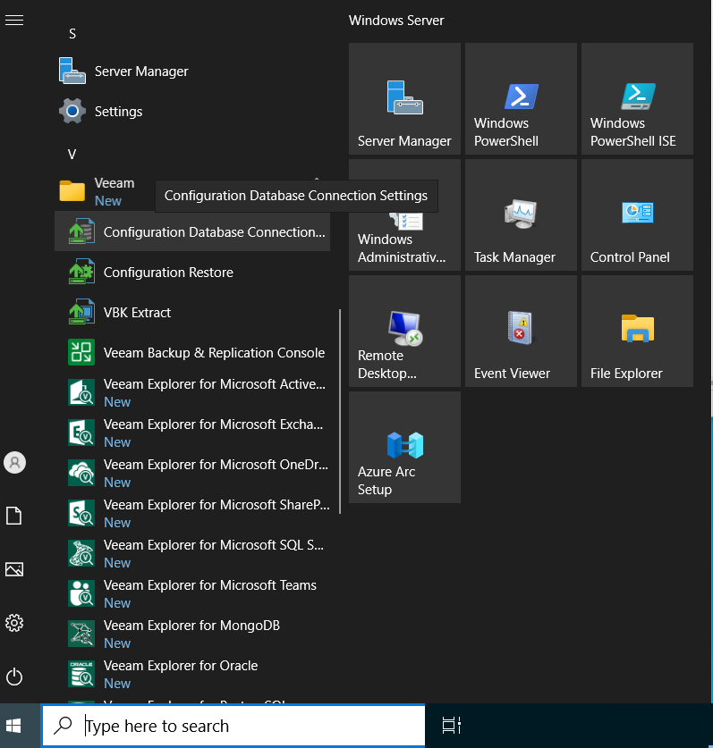

# Step 1. Launch Utility

In this article

You can launch the configuration database connection utility using one of the following ways:

* From the Start menu, click Configuration Database Connection Settings.
* Use the Veeam.Backup.DBConfig.exe file located in the installation folder. The default path to the folder is the following: %PROGRAMFILES%\Common Files\Veeam\Backup and Replication\DBConfig.
* Use the Veeam.Backup.DBConfig.exe file located in the ISO file. The path to the file is the following: %ISO%:\Tools\DBConfig.

To run the utility, you must have administrative rights on the local machine, as the utility makes changes to the registry. If prompted at the launch, choose Run as administrator.

Page updated 11/5/2025

Page content applies to build 13.0.1.1071
