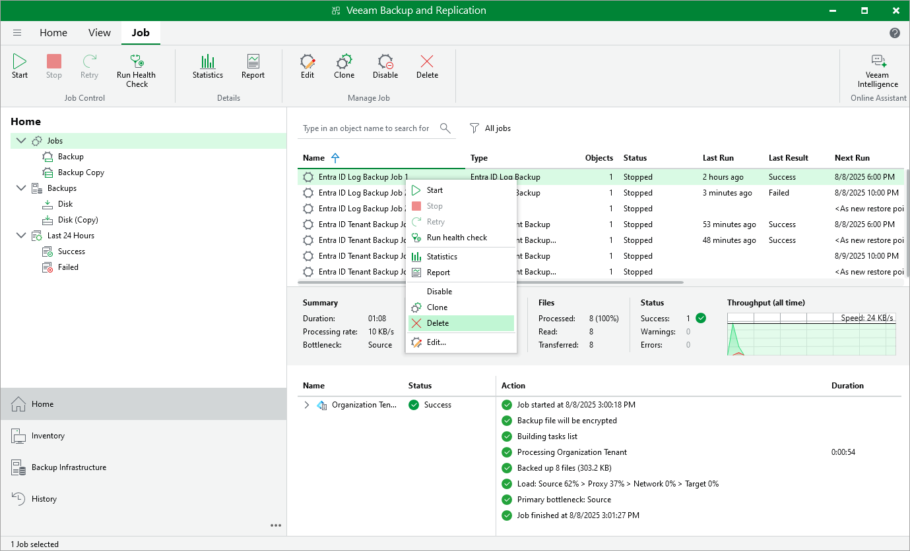

# Deleting Backup Jobs

To delete a job:

1. Open the Home view.
2. In the inventory pane, navigate to the Jobs > Backup node.
3. In the working area, select the job and click Delete on the ribbon or right-click the job and select Delete.

After the job is deleted, the backups created by this job are displayed under the Backups > Disk (Orphaned) node.

