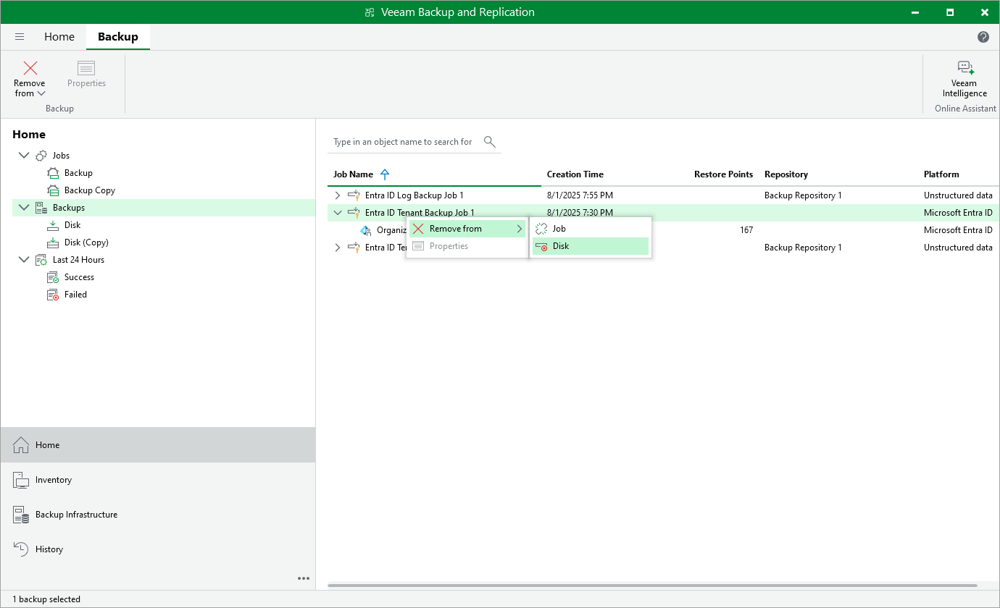
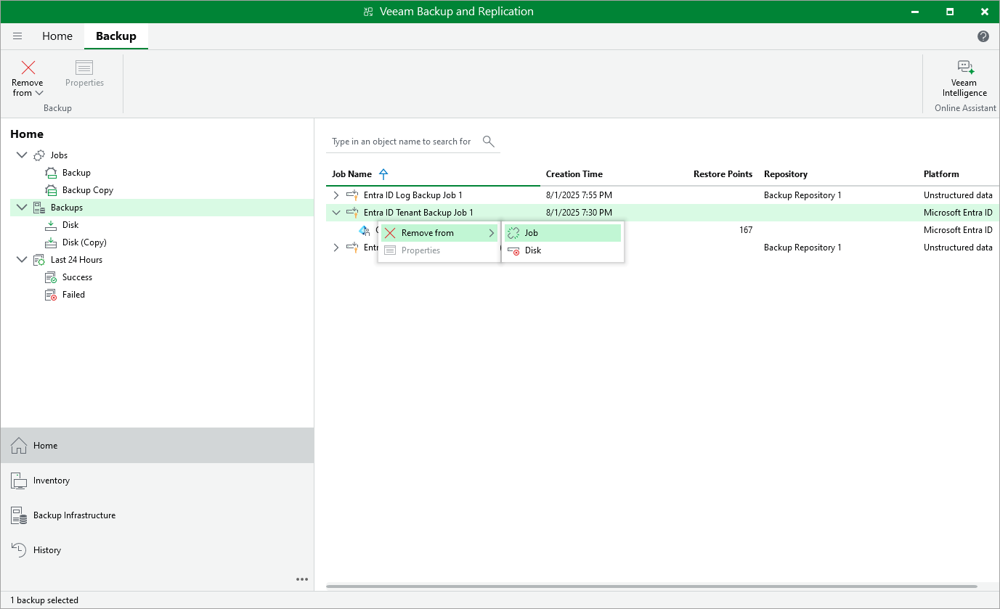

# Removing Tenant and Log Backups

In this article

Veeam Backup for Microsoft Entra ID applies the [configured retention policy settings](entra_id_backup_job.md) to automatically remove backups and backup copies from backup repositories (both primary and secondary). If necessary, you can also remove the backed-up data manually.

Alternatively, you can detach backups from a backup or backup copy job — this may be helpful, for example, if you plan to reconfigure the job. In this case, backup files will remain in the target backup repository but will be treated by Veeam Backup & Replication as orphaned entities, which will be retained according to their own background retention settings. For more information, see the Veeam Backup & Replication User Guide, section [Background Retention](https://helpcenter.veeam.com/docs/vbr/userguide/background_retention_job.html?ver=120).

Removing Backups

To remove backed-up data manually, do the following:

1. Open the Home view.

1. In the inventory pane, select Backups.

1. In the working area, select the necessary backup and click Remove from > Disk on the ribbon. Alternatively, you can right-click the backup and select Remove from disk.

Detaching Backups

To detach backups from a backup or backup copy job:

1. Open the Home view.
2. In the inventory pane, select the Backups node.
3. In the working area, select the necessary backup and select  Remove from > Job on the ribbon. Alternatively, you can right-click the backup and select Remove from > Job

|  |
| --- |
| Important |
| Before you detach any backup or backup copy, make sure that all related jobs are [disabled](entra_id_enable_job.md). |

Page updated 9/3/2025

Page content applies to build 13.0.1.1071
