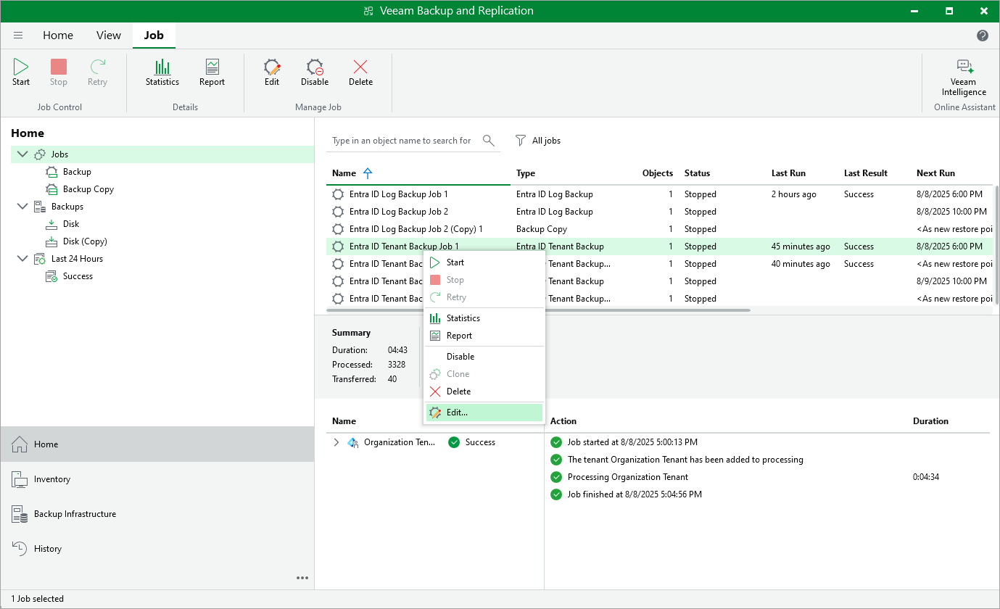

# Editing Backup Job Settings

For each backup job, you can modify the settings configured while creating the job:

1. Open the Home view and navigate to Jobs > Backup.
2. In the working area, select the job and click Edit on the ribbon.

Alternatively, you can right-click the job and select Edit.

1. Edit the necessary job settings as follows:

* To provide a new name and description for the job, follow the instructions provided in section [Creating Tenant Backup Jobs](entra_id_job_name.md) (step2) or [Creating Log Backup Jobs](entra_id_log_job_name.md) (step 2).
* To choose another project or folder that manages resources that you want to protect, or change the service account whose permissions are used to perform backup operations, follow the instructions provided in section Performing VM Backup (step 3), Performing SQL Backup (step 3) or Performing Spanner Backup (step 3).
* To modify the list of regions in which instances that you plan to back up reside, or to add instances to the backup scope, follow the instructions provided in section Performing VM Backup (step 4a or step 4b), Performing SQL Backup (step 4a or step 4b) or Performing Spanner Backup (step 4a or step 4b).
* To instruct Veeam Backup & Replication to create image-level backups, follow the instructions provided in section Performing VM Backup (step 5), Performing SQL Backup (step 5) or Performing Spanner Backup (step 5).
* To modify the schedule configured for the policy, follow the instructions provided in section Performing VM Backup (step 6), Performing SQL Backup (step 6) or Performing Spanner Backup (step 6).
* [Applies only to VM backup policies] To assign labels to cloud-native snapshots, follow the instructions provided in section Performing VM Backup (step 7).
* [Applies only to SQL backup policies] To choose whether you want to use a staging server to perform backup, follow the instructions provided in section Performing SQL Backup (step 7).
* To configure automatic retry, health check and notification settings, follow the instructions provided in section Performing VM Backup (step 8), Performing SQL Backup (step 8) or Performing Spanner Backup (step 8).
* At the Summary step of the wizard, review configuration information and click Finish to confirm the changes.

You will follow the same steps you followed when creating the job and can change job settings as required.

