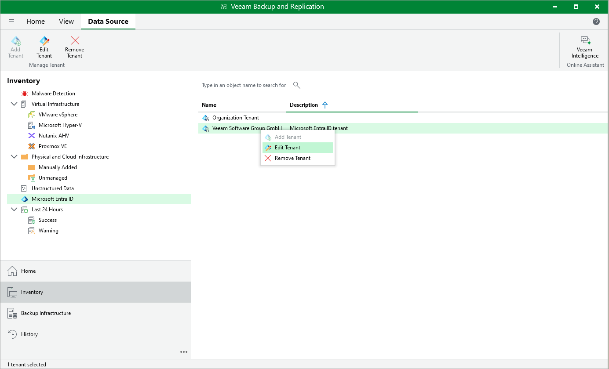

# Editing Microsoft Entra ID Tenants

In this article

You can edit properties of the Microsoft Entra ID tenant added to the backup infrastructure. These properties include the tenant description in Veeam Backup & Replication, cache repository, application used to perform operations and authentication method used to access the application.

To edit tenant properties:

1. Open the Inventory view.
2. In the inventory pane, click Microsoft Entra ID.
3. Select the tenant that you want to edit.
4. Right-click the tenant and select Edit. Alternatively, click Edit Tenant on the ribbon.

Page updated 8/5/2025

Page content applies to build 13.0.1.1071
