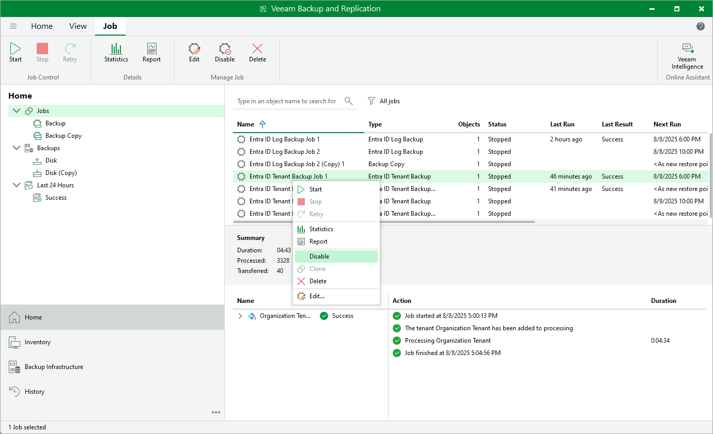

# Enabling and Disabling Backup Jobs

In this article

You can disable a job with the enabled schedule.

To disable a job:

1. Open the Home view.
2. In the inventory pane, navigate to the Jobs > Backup node.
3. In the working area, select the job and select Disable on the ribbon or right-click the job and select Disable.

To enable a disabled job, select it in the list and click Disable on the ribbon once again.

Page updated 8/8/2025

Page content applies to build 13.0.1.1071
