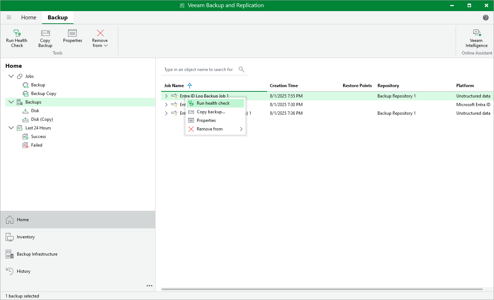
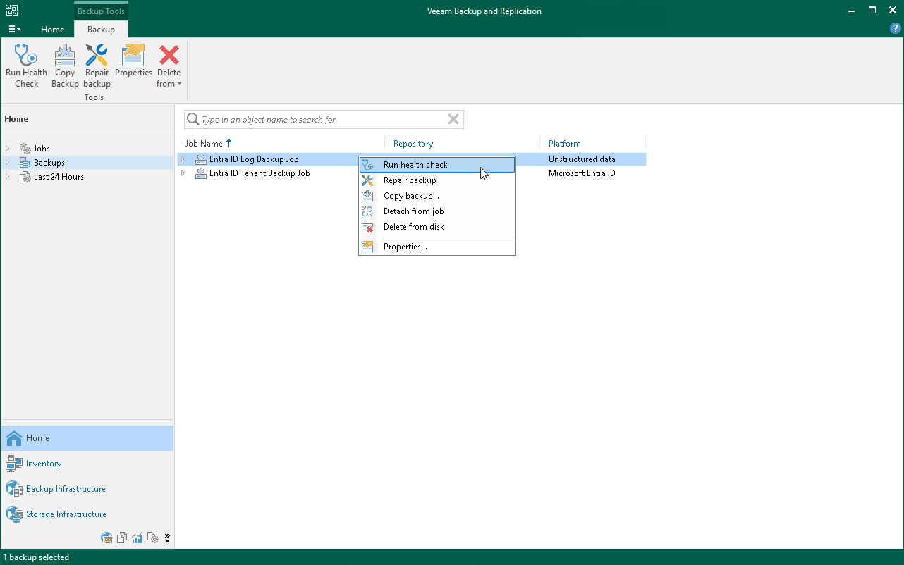

# Performing Health Check for Log Backups

This section applies to log backups only.

In this section, you will learn how to perform health check and repair log backups.

Health Check for Log Backup Files

You can manually perform a health check for the backup chain. During the health check, Veeam Backup & Replication performs a cyclic redundancy check (CRC) for metadata and a hash check for data blocks in backup files to verify their integrity. The health check helps make sure that the restore point is consistent, and you will be able to restore data from this restore point.

To run the health check:

1. Open the Home view.
2. In the inventory pane, select Backups.
3. In the working area, select the required log backup and click Run Health Check on the ribbon. Alternatively, you can right-click the backup and select Run health check.

To run the health check periodically, you must enable the Perform backup files health check option in the backup job settings and define the health check schedule. By default, the health check is performed on the last Friday of every month. You can change the schedule and run the health check weekly or monthly on specific days. To learn how to configure periodic health check, see [Maintenance Settings](entra_id_log_job_advanced.md#maint).

|  |
| --- |
| Important |
| If you store your backups on public cloud object storage repositories, running the health check operations may result in constantly downloading and uploading data to and from the storage, which may lead to higher costs. To avoid this, use helper appliances configured for the repositories within the public clouds. For more information, see the [Unstructured Data Backups in Object Storage Repositories](https://helpcenter.veeam.com/docs/vbr/userguide/unstructured_data_backup_in_object_storage.html?ver=13) section in the Veeam Backup & Replication User Guide. |

Repair of Log Backup Files

If Veeam Backup & Replication detects some inconsistency in the log backup files during the health check, you can run the backup repair procedure to fix the issues.

To run the backup repair:

1. Open the Home view.
2. In the inventory pane, select Backups.
3. In the working area, select the required log backup, click Repair backup on the ribbon. Alternatively, you can right-click the backup and select Repair backup.

