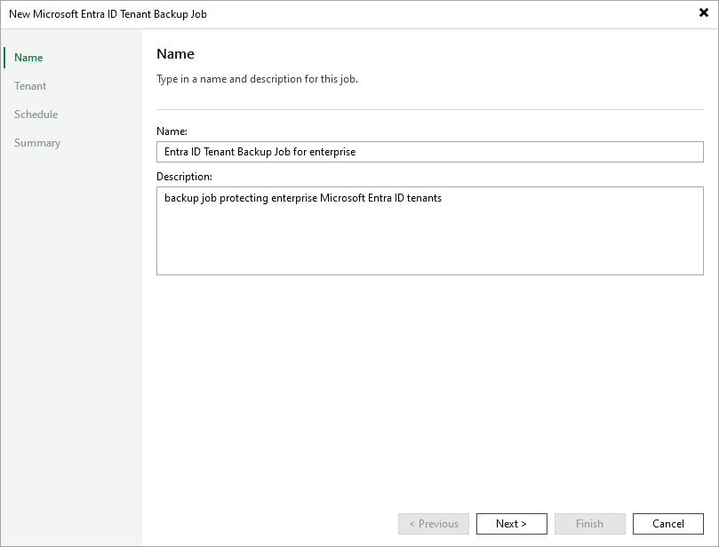

# Step 2. Specify Job Name and Description

In this article

At the Name step of the wizard, use the Name and Description fields to enter a name for the new backup job and to provide a description for future reference. The maximum length of the name is 255 characters. The following characters are not supported: / \ " ' : | < > + = ; , ? ! \* % # ^ @ & $ .

Page updated 10/1/2025

Page content applies to build 13.0.1.1071
