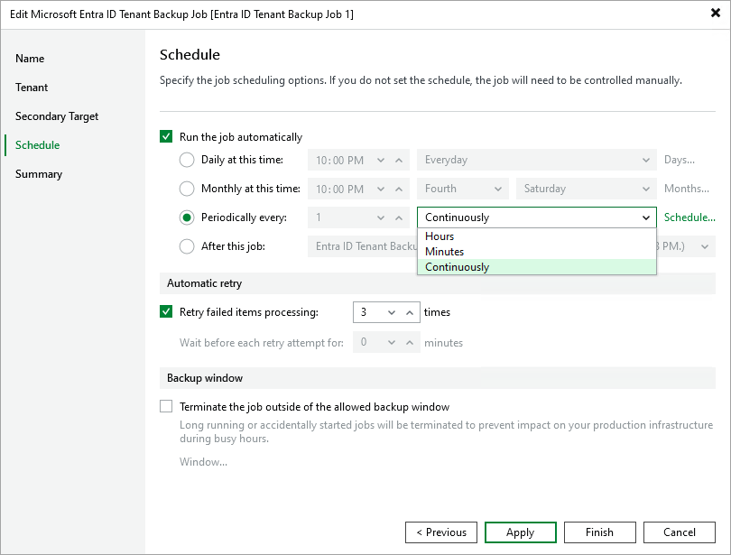

# Step 5. Define Job Schedule

At the Schedule step of the wizard, you can instruct Veeam Backup for Microsoft Entra ID to run the backup job automatically according to a specific backup schedule — to do that, select the Run the job automatically check box. The backup schedule defines how often data of the tenant added to the backup job will be backed up.

To help you implement a comprehensive backup strategy, Veeam Backup for Microsoft Entra ID allows you to create schedules of the following types:

* Daily — the backup job will run at a specific time on specific days.

To create a daily schedule for the backup job, select the Daily at this time option and define the exact hour when the job will create restore points. Then, use the drop-down list to choose whether you want the backup job to run every day, on weekdays (Monday through Friday) or on specific days.

* Monthly — the backup job will run once a day on specific days.

To create a monthly schedule for the backup job, select the Monthly at this time option and define the exact hour when the job will create restore points. Then, use the drop-down lists to schedule the specific days and months for the backup job to run.

* Periodically — the backup job will run repeatedly throughout a day with a specific time interval.

To create a periodical schedule for the backup job, select the Periodically every option and define the frequency (in hours or minutes) with which the job will create restore points. Alternatively, you can instruct Veeam Backup for Microsoft Entra ID to create backups continuously, one after another.

To prevent backup operations from overlapping with production hours, it is recommended that you configure a time interval during which Veeam Backup for Microsoft Entra ID is allowed to create restore points; to do that, click Schedule and configure the necessary interval. If a backup operation exceeds the configured time interval, this operation will not be terminated unless you [specify a backup window](#backup_window).

* Subsequently — the backup job will run after another job.

To create a subsequent schedule for the backup job, select the After this job option and use the drop-down list to choose the necessary job.

|  |
| --- |
| NoteS |
| * If you do not select the Run the job automatically check box, Veeam Backup for Microsoft Entra ID will only create restore points when you [start the backup job manually](entra_id_start_job.md). * If you select the Run the job automatically check box but do not configure any scheduling settings, Veeam Backup for Microsoft Entra ID will run the job daily at 10:00 PM. |

Additionally, you can configure the following settings:

* Instruct Veeam Backup for Microsoft Entra ID to run the backup job again if it fails on the first try.

To do that, select the Retry failed items processing check box and specify the maximum number of attempts to run the backup job.

* Instruct Veeam Backup for Microsoft Entra ID  to terminate the backup job if it creates unwanted overhead for the production environment.

To do that, select the Terminate the job outside of the allowed backup window check box and click Window. Then, define a time interval during which Veeam Backup for Microsoft Entra ID is allowed to run the backup job. If a backup operation exceeds the configured time interval, this operation will be terminated automatically.

|  |
| --- |
| NoteS |
| * When retrying backup jobs, Veeam Backup & Replication processes only those items that failed to be backed up during the previous attempt. * Automatic retry settings apply only to backup jobs that run according to specific schedules — these settings do not apply to jobs started manually. * The default time interval between retries cannot be modified for backup jobs that create restore points continuously according to a periodical schedule. When running these jobs, Veeam Backup & Replication will make retry attempts one after another, without any interval. |

