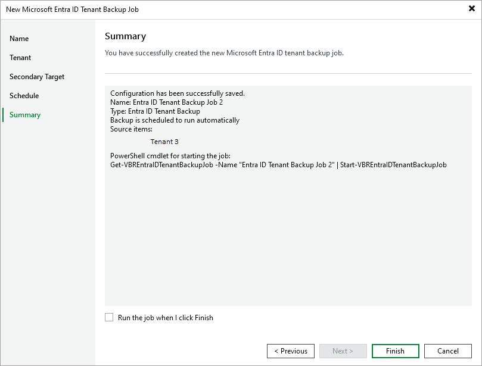

# Step 6. Finish Working with Wizard

At the Summary step of the wizard, review configuration information and click Finish.

|  |
| --- |
| Tip |
| If you want to run the backup job right after you finish working with the wizard, select the Run the job when I click Finish check box. Alternatively, you can run the job manually later as described in section [Starting and Stopping Backup Jobs](entra_id_start_job.md). |

