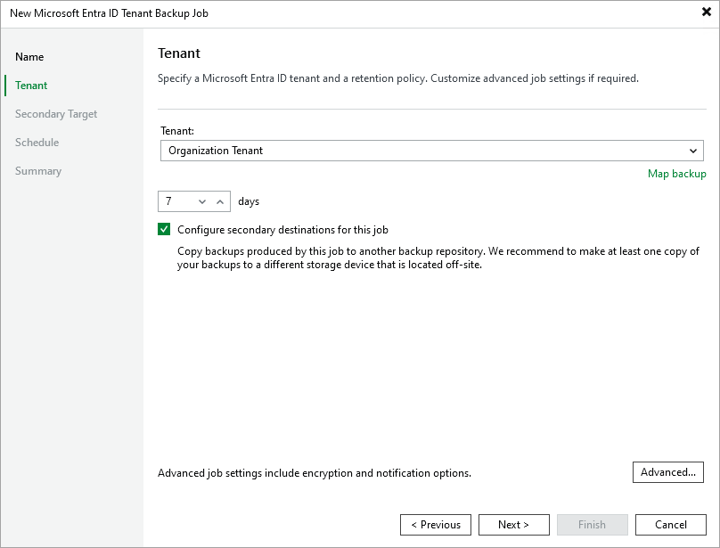

# Step 3. Configure Backup Source Settings

At the Tenant step of the wizard, select a Microsoft Entra ID tenant whose resources you want to back up, and specify the number of days for which you want to keep restore points in a backup chain. If a restore point is older than the specified time limit, Veeam Backup for Microsoft Entra ID removes the restore point from the chain.

By default, Veeam Backup & Replication saves all backed-up tenant data to the local Microsoft Entra ID backup repository. To increase data availability and ensure that it can be recovered in case a disaster strikes, you can instruct Veeam Backup for Microsoft Entra ID to copy the backed-up tenant data to another location. To do that, select the Configure secondary destinations for this job check box and follow the instructions provided at [step 4](entra_id_tenant_backup_copy.md).

When [restoring data of the backed-up tenant](entra_id_tenant_restore.md), Veeam Backup & Replication will offer you to choose a restore point from the list of all restore points available both in the default and secondary backup repositories (if applicable). To allow Veeam Backup & Replication to detect restore points created for this tenant by other backup jobs or stored in other backup repositories, you can map these restore points to this backup job — this way, Veeam Backup & Replication will transfer less data over network, reducing unwanted overhead for the production environment. To do that, click Map backup and choose the necessary backup.

|  |
| --- |
| Tip |
| Veeam Backup for Microsoft Entra ID does not encrypt backed-up data and uses the [global notification settings](https://helpcenter.veeam.com/docs/vbr/userguide/general_email_notifications.html?ver=13) configured for the backup server. To use password-based data encryption and specify custom notification settings for the backup job, click Advanced and follow the instructions provided in section [Advanced Settings](entra_id_tenant_backup_advanced_settings.md). |

Related Topics

* [Advanced Settings](entra_id_tenant_backup_advanced_settings.md)
* [Secondary Repository Settings](entra_id_tenant_backup_copy.md)

