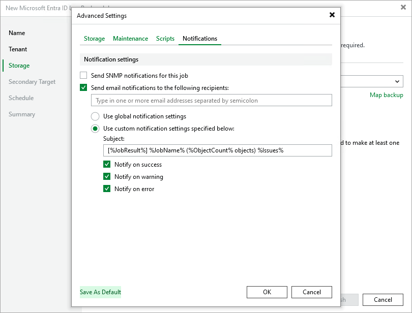

# Advanced Settings

In this article

In the Advanced Settings window, you can configure additional log backup job settings, such as compression level, password-based data encryption and custom notification settings.

Data Compression and Encryption Settings

By default, Veeam Backup & Replication does not encrypt backup files and uses the Optimal compression level to store these files. To change this behavior, switch to the Storage tab and do the following:

* To decrease the size of the files, select a compression level from the Compression level drop-down list (None, Dedupe-friendly, Optimal, High or Extreme). For more information on compression levels, see the Veeam Backup & Replication User Guide, section [Data Compression and Deduplication](https://helpcenter.veeam.com/docs/vbr/userguide/compression_deduplication.html?ver=13).
* To encrypt the content of the files, select the Enable backup file encryption check box and specify a password that will be used to encrypt data.

For a password to be displayed in the list of available passwords, it must be added to the Password Manager as described in the Veeam Backup & Replication User Guide, section [Managing Credentials](https://helpcenter.veeam.com/docs/vbr/userguide/password_manager.html?ver=13). If you have not added the necessary password beforehand, you can do it without closing the Advanced Settings window. To do that, click either Manage passwords or Add, and specify the password and a hint in the Password window.

|  |
| --- |
| NoteS |
| * For security reasons, Veeam Backup & Replication does not store the password you specify to encrypt data — that is why you will not be able to restore data from encrypted backups in case you lose the password. However, if your backup server is connected to Veeam Backup Enterprise Manager, you can recover the password as described in the Veeam Backup & Replication User Guide, section [Password Loss Protection](https://helpcenter.veeam.com/docs/vbr/userguide/decrypt_without_pass.html?ver=13). * To encrypt backed-up data, you can also use KMS keys as described in the Veeam Backup & Replication User Guide, section [Key Management System Keys](https://helpcenter.veeam.com/docs/vbr/userguide/kms.html?ver=13). |

Maintenance Settings

[Health checks](entra_id_health_check_hiw.md) help you ensure that the restore points created by the backup job are consistent and that you will be able to restore data using these restore points. To instruct Veeam Backup & Replication to periodically perform a health check for the restore points created by the job, switch to the Maintenance tab and do the following:

* Select the Perform backup files health check check box.

* To configure a custom schedule, click Configure and choose whether you want the health check sessions to run monthly, weekly or on specific days.

By default, Veeam Backup & Replication runs health check sessions every last Saturday of a month.

Script Settings

Scripts allow you to execute customized tasks before or after backup sessions, such as removing temporary files or tracking permission updates in Entra ID environment. To instruct Veeam Backup & Replication to run a custom script, switch to the Scripts tab and do the following:

1. Select the Run the following script before the job or Run the following script after the job check box.
2. Click Browse to choose executable files from a local folder on the backup server.
3. Choose whether you want Veeam Backup & Replication to execute the script periodically or on specific days only.

Notification Settings

Notification settings help you automate and customize delivery of the backup job results. To instruct Veeam Backup & Replication to send email notifications on the backup job status to specific addresses, switch to the Notifications tab and do the following:

* To receive SNMP notifications on the backup job, select the Send SNMP notifications for this job check box.

For Veeam Backup & Replication to be able to send SNMP notifications, you must configure global SNMP settings as described in the Veeam Backup & Replication User Guide, section [Specifying SNMP Settings](https://helpcenter.veeam.com/docs/vbr/userguide/snmp_settings.html?ver=13).

* To receive notifications by email in case of backup failure, success or warning, select the Send email notifications to the following recipients check box and specify an email address of a recipient; use a semicolon to separate multiple recipient addresses.

For Veeam Backup & Replication to be able to send email notifications, you must configure global email notification settings as described in the Veeam Backup & Replication User Guide, section [Configuring Global Email Notification Settings](https://helpcenter.veeam.com/docs/vbr/userguide/general_email_notifications.html?ver=13).

* To specify custom notification subject, select Use custom notification settings specified below check box, and create a notification subject using the runtime variables provided in the Subject field.

|  |
| --- |
| Tip |
| To instruct Veeam Backup & Replication to further use any of the updated advanced settings by default, click Save As Default in the respective tab. |

Page updated 12/4/2025

Page content applies to build 13.0.1.1071
