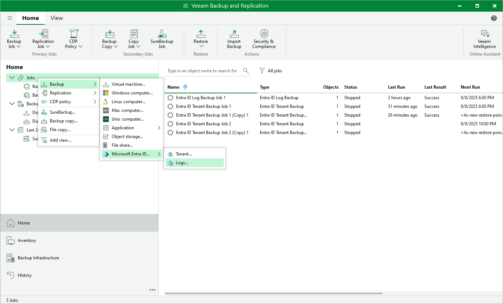

# Step 1. Launch New Microsoft Entra ID Log Backup Job Wizard

In this article

To launch the Microsoft Entra ID Log Backup Job wizard, do either of the following:

* Open the Home view. On the ribbon, click Backup Job > Microsoft Entra ID > Logs.
* Open the Home view. In the inventory pane, right-click Jobs and select Backup > Microsoft Entra ID > Logs.

Page updated 10/1/2025

Page content applies to build 13.0.1.1071
