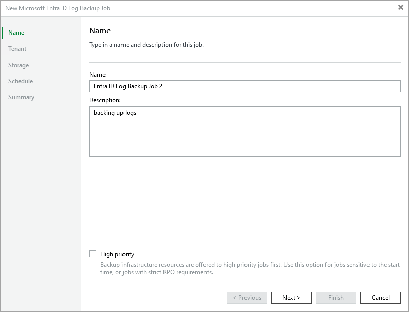

# Step 2. Specify Job Name and Description

At the Name step of the wizard, use the Name and Description fields to enter a name for the new backup job and to provide a description for future reference. The maximum length of the name is 255 characters. The following characters are not supported: / \ " ' : | < > + = ; , ? ! \* % # ^ @ & $ .

|  |
| --- |
| Tip |
| If you want Veeam Backup & Replication to prioritize the log backup job over other jobs and to allocate backup infrastructure resources to this job first, select the High priority check box. For more information on job priorities, see the Veeam Backup & Replication User Guide, section [Getting Started](https://helpcenter.veeam.com/docs/vbr/userguide/job_priorities.html?ver=13). |

