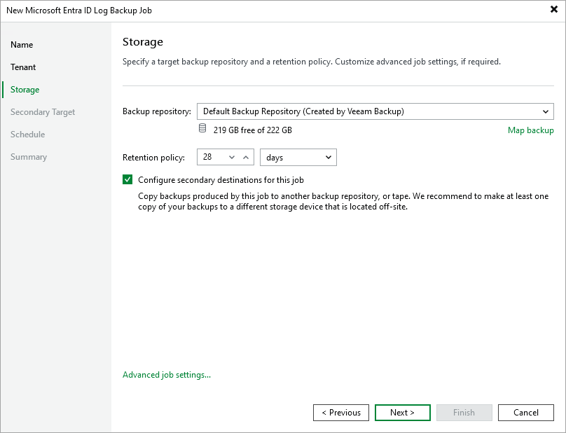

# Step 4. Specify Backup Repository Settings

At the Storage step of the wizard, you can choose a backup repository where the backed-up log data will be stored. You can also specify the number of days, months or years for which you want to keep restore points in a backup chain — if a restore point is older than the specified time limit, Veeam Backup for Microsoft Entra ID removes the restore point from the chain.

To increase data availability and ensure that it can be recovered in case a disaster strikes, you can instruct Veeam Backup for Microsoft Entra ID to copy the backed-up log data to another backup repository. To do that, select the Configure secondary destinations for this job check box and follow the instructions provided at [step 4](entra_id_log_job_secondary.md).

|  |
| --- |
| Note |
| Veeam Backup for Microsoft Entra ID does not support storing log backups in [Veeam Cloud Connect repositories](https://helpcenter.veeam.com/docs/backup/cloud/cloud_connect_repository.html?ver=13) or [Amazon S3 repositories with multiple buckets](https://helpcenter.veeam.com/docs/vbr/userguide/object_storage_repository.html?ver=13#childbuckets). |

When [restoring backed-up log data](entra_id_log_restore.md), Veeam Backup & Replication will offer you to choose a restore point from the list of all restore points available both in the primary and secondary backup repositories (if applicable). To allow Veeam Backup & Replication to detect restore points created for this log data by other backup jobs or stored in other backup repositories, you can map these restore points to this backup job — this way, Veeam Backup & Replication will transfer less data over network, reducing unwanted overhead for the production environment. To do that, click Map backup and choose the necessary backup.

|  |
| --- |
| Tip |
| To help you implement a comprehensive backup strategy, Veeam Backup & Replication allows you to configure additional backup job settings (for example, you can enable health check, upload custom scripts and customize email notifications). To do that, click Advanced job settings and follow the instructions provided in section [Advanced Settings](entra_id_log_job_advanced.md). |

