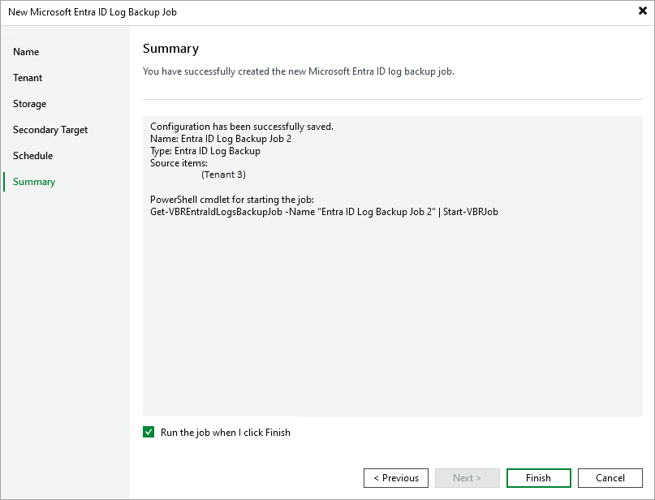

# Step 7. Finish Working with Wizard

In this article

At the Summary step of the wizard, review summary information and click Finish. You will be able to edit the configured backup job settings as described in the [Editing Backup Job Settings](entra_id_edit_job_setting.md) section.

|  |
| --- |
| Tip |
| If you want to run the job immediately after you finish working with the wizard, select the Run the job when I click Finish check box. |

Page updated 10/28/2025

Page content applies to build 13.0.1.1071
