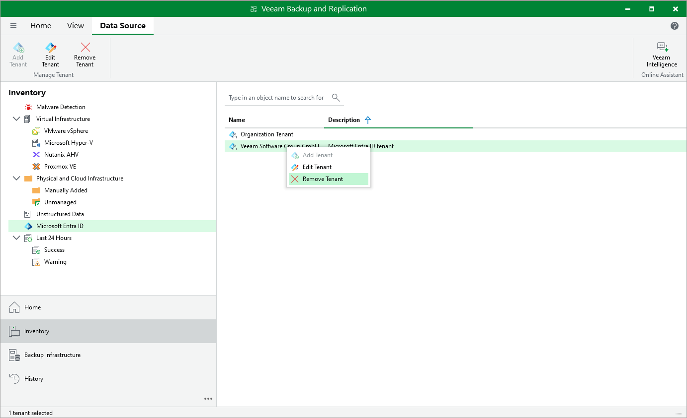

# Removing Microsoft Entra ID Tenants

In this article

If you do not want to protect the added Microsoft Entra ID tenant anymore, you can remove it from the backup infrastructure. Note that the tenant will be removed only from the backup infrastructure, not Entra ID.

|  |
| --- |
| Note |
| You cannot remove a Microsoft Entra ID tenant protected by any job. To remove such a tenant, you first need to delete the backup jobs associated with this tenant. |

To remove a tenant:

1. Open the Inventory view.
2. In the inventory pane, click Microsoft Entra ID.
3. Select the tenant that you want to delete.
4. Right-click the tenant and select Remove. Alternatively, click Remove Tenant on the ribbon.

Page updated 8/5/2025

Page content applies to build 13.0.1.1071
