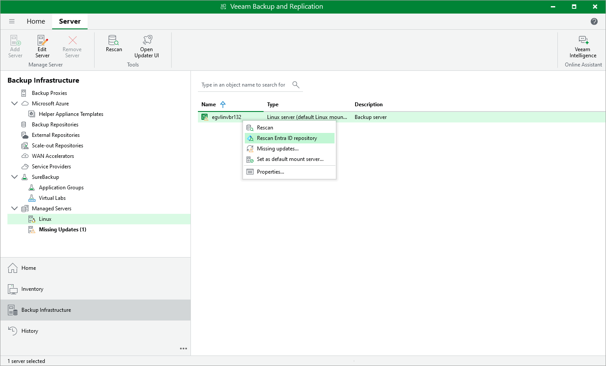

# Rescanning Microsoft Entra ID Repository

In this article

Backup repository rescan can be required in the following cases:

* You have moved information from one PostgreSQL instance on which the repository is based to another instance.
* You have restored the Veeam Backup & Replication configuration database.
* After a job failed and it requested backup repository rescan.
* Other cases.

|  |
| --- |
| Note |
| We recommend you to stop or disable all jobs before performing the rescan.Veeam Backup & Replication skips from scanning backups created by active jobs. |

To rescan the Microsoft Entra ID backup repository:

1. Open the Backup Infrastructure view.
2. In the inventory pane, select the Managed Servers > Microsoft Windows or Linux node.
3. In the working area, select the backup server.
4. Press and hold the [Ctrl] key, right-click the backup server and select Rescan Entra ID repository.

Page updated 12/17/2025

Page content applies to build 13.0.1.1071
