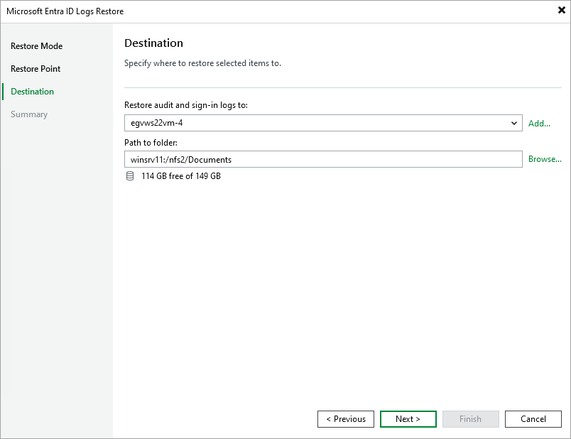

# Step 5. Specify Destination for File Restore

In this article

At the Destination step, specify the destination where the restored files and folders must be stored:

1. In the Restore files and folders to field, select a file share to which the files must be restored.

All file shares added to the inventory of Veeam Backup & Replication are available in the drop-down list. If the required file share is missing, click Add and add a new file share to Veeam Backup & Replication. For more information on how to add a new file share, see the [Adding Unstructured Data Source](https://helpcenter.veeam.com/docs/vbr/userguide/adding_unstructured_data_source.html?ver=120) section in the Veeam Backup & Replication User Guide.

1. In the Path to folder field, specify a path to the folder on the selected file share where files must be restored. You can enter the path or specify it using Browse.

Page updated 9/3/2025

Page content applies to build 13.0.1.1071
