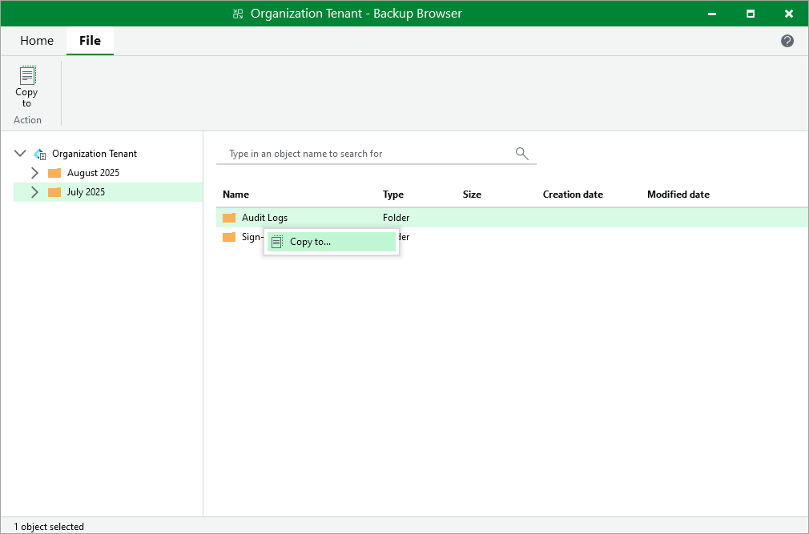

# Step 2. Select Files and Folders to Restore

In this article

In the Backup Browser window, select files or folders that you want to restore, right-click one of them and select Copy to. Alternatively, you can use Copy to on the ribbon.

Page updated 8/12/2025

Page content applies to build 13.0.1.1071
