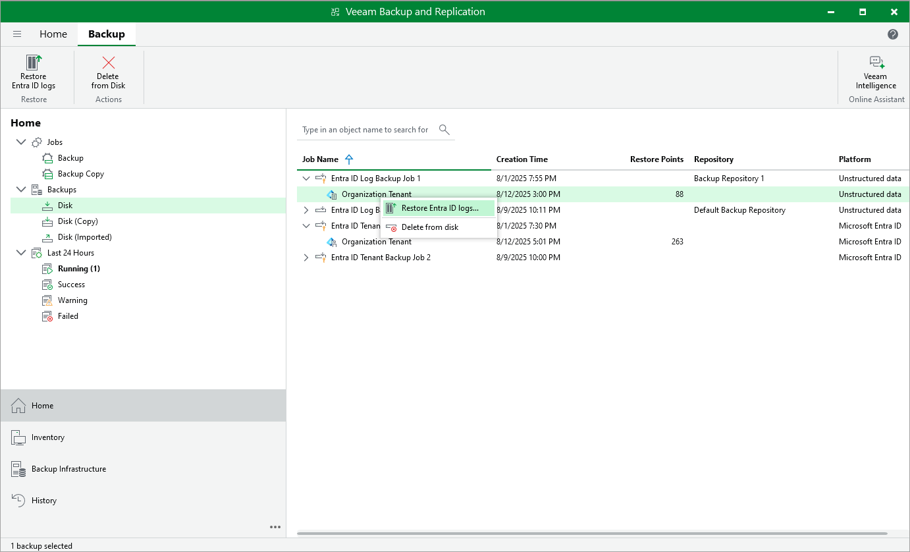

# Step 1. Launch Microsoft Entra ID Audit Restore Wizard

To launch the restore wizard, do the following:

1. Open the Home view.
2. In the inventory pane, select the Backups > Disk node.
3. In the working area, expand the backup job that protects the logs that you want to restore.
4. Select the tenant whose logs are protected and click Restore Entra ID Logs Restore on the ribbon. Alternatively, you can right-click the tenant and select Restore Entra ID logs.

