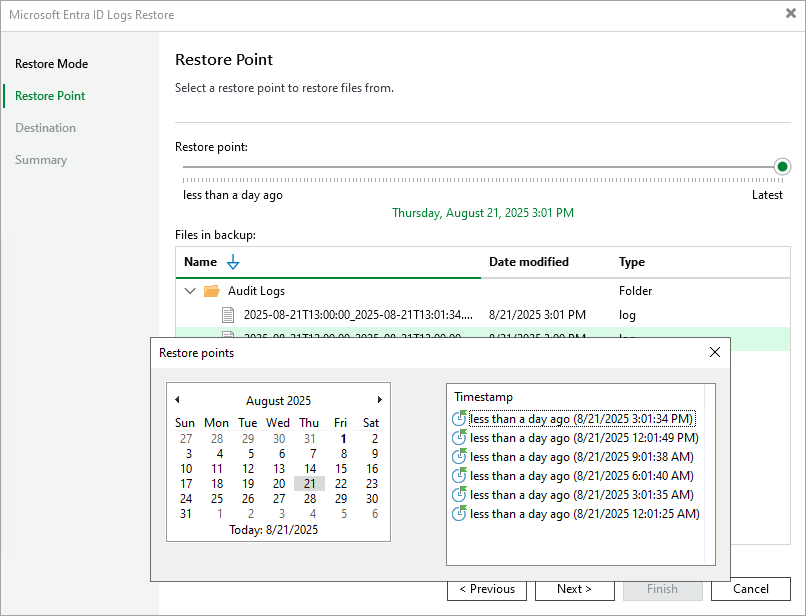

# Step 4. Select Restore Point

In this article

This step is available if you restore folders and you have selected Earlier restore point at the [Restore Mode](entra_id_restore_log_mode.md) step of the wizard.

At the Restore Point step of the wizard, select the point in time to restore folders and files to. To select the required restore point, do one of the following:

* Use the Restore point slider.

* Click the date link under the Restore point slider. In the calendar in the left pane of the Restore points window, select the date when the required restore point was created. The list of restore points in the right pane displays restore points created on the selected date. Select the point to which you want to restore the files and folders.

In the Files in backup tree, you can see what folders and files are covered by the selected restore point and the date when files and folders were modified.

Page updated 8/21/2025

Page content applies to build 13.0.1.1071
