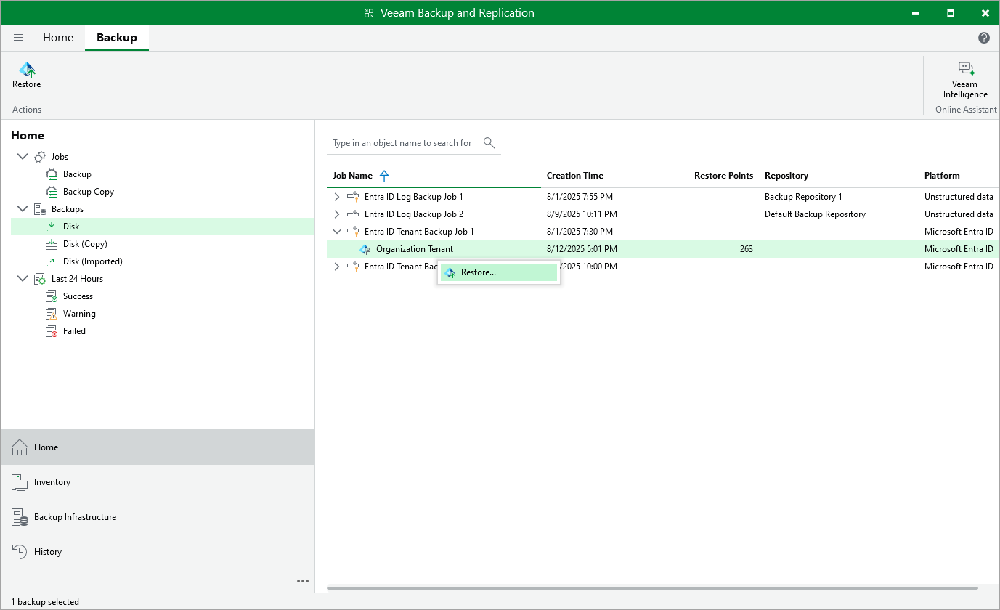

# Step 1. Launch Microsoft Entra ID Tenant Restore Wizard

To launch the Microsoft Entra ID Tenant Restore wizard, do the following:

1. In the Veeam Backup & Replication console, open the Home view and navigate to Backups.
2. In the working area, expand the backup job that protects the Microsoft Entra tenant whose data you want to restore, select the tenant and click Restore on the ribbon.

Alternatively, you can right-click the tenant and select Restore.

