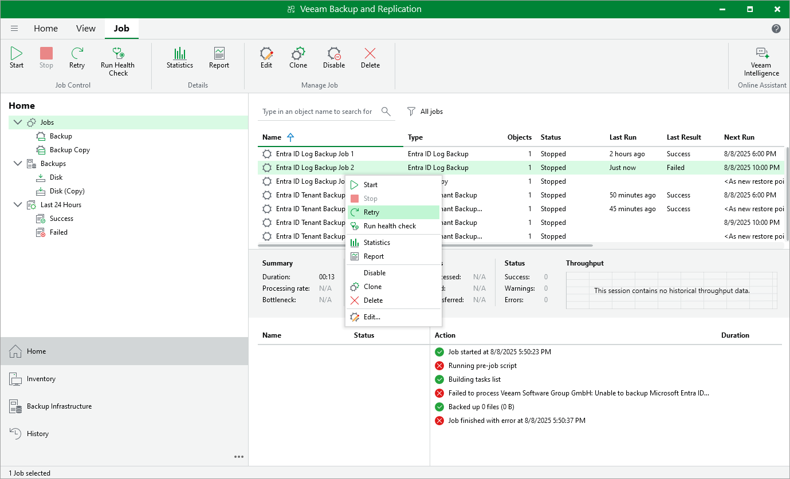

# Retrying Jobs

In this article

The retry option is necessary if a job fails and you want to retry this operation again. When you perform a retry, Veeam Backup & Replication restarts the operation only for the failed workloads added to the job and does not process workloads that have been processed successfully. As a result, the retry operation takes less time than running the job for all workloads.

To perform retry:

1. Open the Home view.
2. In the inventory pane, select Jobs.
3. In the working area, select the necessary job and click Retry on the ribbon. Alternatively, you can right-click the job and select Retry.

Page updated 8/8/2025

Page content applies to build 13.0.1.1071
