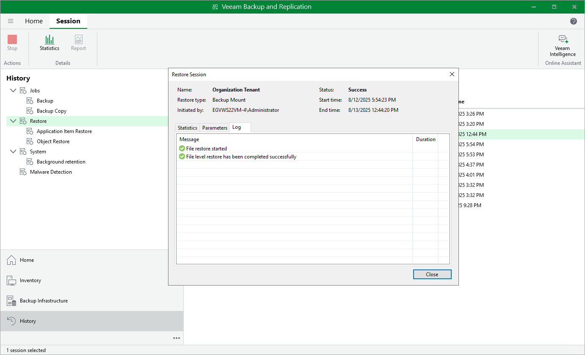

# Viewing Session Statistics

In this article

For each performed data protection or disaster recovery operation, Veeam Backup for Microsoft Entra ID starts a new session and stores its records in the configuration database.

Viewing Session Statistics Using Console

You can track real-time statistics of all running and completed operations on the Jobs, Last 24 hours and Running nodes. For more information, see the Veeam Backup & Replication User Guide, sections [Viewing Real-Time Statistics](https://helpcenter.veeam.com/docs/vbr/userguide/realtime_statistics.html?ver=13) and [Viewing Job Session Results](https://helpcenter.veeam.com/docs/vbr/userguide/session_results.html?ver=13).

Veeam Backup & Replication also allows you track statistics of most data recovery operations initiated from Veeam Backup for Microsoft Entra ID. To do that, do either of the following:

* In the Veeam Backup & Replication console, open the Home view and navigate to Last 24 hours. In the working area, double-click the necessary session.

Alternatively, select the session and click Statistics on the ribbon.

* In the Veeam Backup & Replication console, open the History view and navigate to Jobs or Restore. In the working area, double-click the necessary session.

Alternatively, select the session and click Statistics on the ribbon.

The opened window will display restore session details such as the name of the Microsoft Entra tenant whose data is being processed, the session status and duration, information on the restore point selected for the operation, and the list of tasks performed during the session.

Page updated 12/19/2025

Page content applies to build 13.0.1.1071
