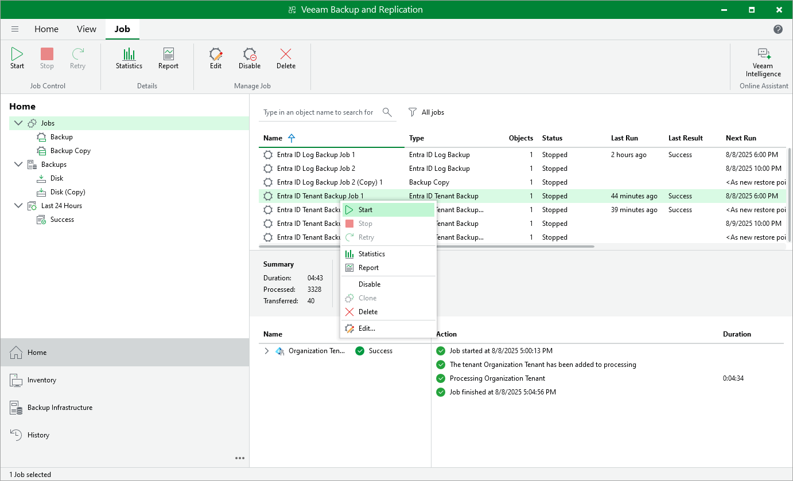

# Starting and Stopping Backup Jobs

You can start a backup job manually, for example, if you want to create an additional restore point and do not want to modify the configured job schedule.

You can also stop a backup job manually if data processing is about to take too long, and you do not want to impact the production environment during business hours. When you stop a running job, Veeam Backup & Replication creates a new restore point only for those workloads that have already been processed by the time you stop the job.

Considerations

Consider the following:

* [For tenant backup job] Veeam Backup & Replication will stop the job immediately and produce a new restore point only for those workloads that have already been processed when you stop the job.

* [For log backup jobs] You can stop the job in two ways:

* Stop the job immediately. In this case, Veeam Backup & Replication will produce a new restore point only for those workloads that have already been processed when you stop the job.

* Stop the job after the current file. In this case, Veeam Backup & Replication will produce a new restore point only for those workloads that have already been processed and for objects that are being processed at the moment.

Starting and Stopping Job

To start or stop a backup job, do the following:

1. Open the Home view.
2. In the inventory pane, select Jobs.
3. In the working area, select the necessary job and click Start or Stop on the ribbon. Alternatively, right-click the job and select Start or Stop.

