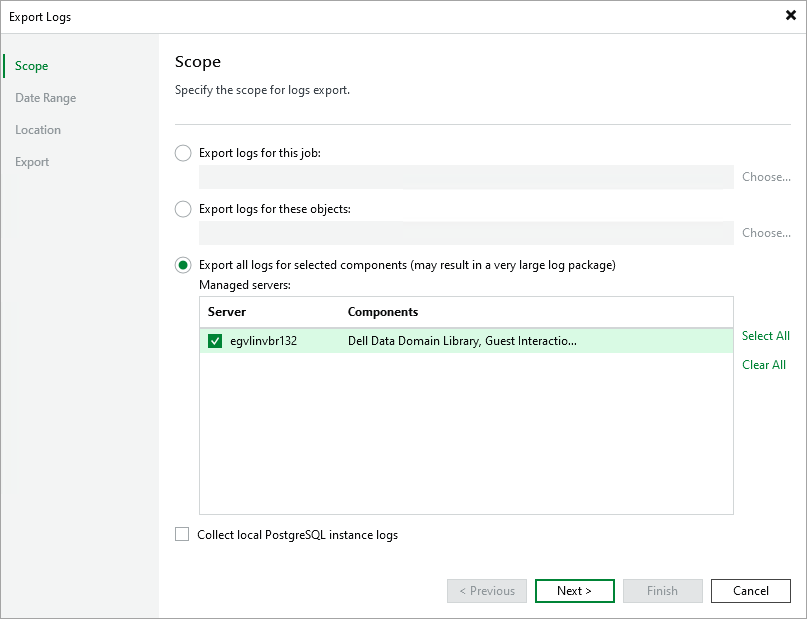

# Getting Technical Support

If you have any questions or issues with Veeam Backup for Microsoft Entra ID, you can search for a resolution on [Veeam R&D Forums](https://forums.veeam.com/) or submit a support case in the [Veeam Customer Support Portal](https://www.veeam.com/support.html).

When you submit a support case, it is recommended that you provide the Veeam Customer Support Team with the following information:

* Version information for the product and its infrastructure components
* The error message or an accurate description of the problem you are facing
* Log files

Downloading Logs

To export the product logs, do the following:

1. In the Veeam Backup & Replication console, open the main menu and navigate to Help > Support Information.
2. In the Export Logs wizard, do the following:

1. At the Scope step, do the following:

1. Select the Export all logs for selected components option.
2. In the Managed servers list, select the backup server.
3. If you use installed Veeam Backup & Replication with the PostgreSQL database and the same database is used to store tenant backups, select Collect local PostgreSQL instance logs.

1. At the Date Range step, specify the time interval for which logs must be collected.
2. At the Location step, specify the destination folder to which the logs will be exported.
3. Wait for the export process to complete, review the results and click the Open folder link to browse to exported log files and log package.

