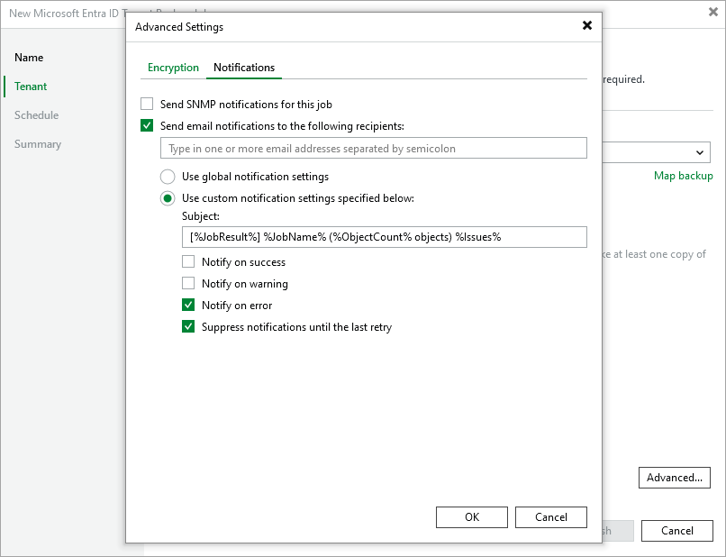

# Advanced Settings

In the Advanced Settings window, you can instruct Veeam Backup for Microsoft Entra ID to use password-based data encryption and specify custom notification settings for the backup job.

Encryption Settings

To enable encryption for the backed-up data, switch to the Encryption tab and do the following:

1. Select the Enable backup data encryption check box.
2. From the Password drop-down list, select the password that you want to use for encryption.

For a password to be displayed in the Password list, it must be added to the Password Manager as described the Veeam Backup & Replication User Guide, section [Password Manager](https://helpcenter.veeam.com/docs/vbr/userguide/password_manager.html?ver=13). If you have not added the necessary password to the Password Manager beforehand, you can do it without closing the Advanced Settings window. To do that, click either the Manage passwords link or the Add button, and specify the password and hint in the Password window.

You can also use KMS keys for encryption. For more information, see Veeam Backup & Replication User Guide, section [Key Management System Keys](https://helpcenter.veeam.com/docs/vbr/userguide/kms.html?ver=13).

Notification Settings

To instruct Veeam Backup & Replication to send email notifications on the backup job results, switch to the Notifications tab and do the following:

1. To enable SNMP notifications for the backup job, select the Send SNMP notifications for this job check box.

By default, Veeam Backup & Replication applies global SNMP settings configured as described in the Veeam Backup & Replication User Guide, section [Specifying SNMP Settings](https://helpcenter.veeam.com/docs/vbr/userguide/snmp_settings.html?ver=13).

1. To add specific recipients, select the Send e-mail notifications to the following recipients check box and specify the necessary e-mail addresses. Use a semicolon to separate multiple recipient addresses.
2. Choose whether you want to apply global notification settings or configure custom settings.

Note that if you choose to use the global notification settings, Veeam Backup & Replication will also send email notifications on the backup job results to recipients configured in the global notification settings.

1. [Applies only if you choose to use custom notification settings] You can specify a subject for notifications in the Subject field. You can use the following runtime variables:

* %JobName% — a backup job name.
* %JobResult% — a backup job result.
* %ObjectCount% — the number of Entra ID resources in a backup job.
* %Issues% — the number of Entra ID resources in a backup job that encountered any issues (errors and warnings) while being processed.

The default subject for email notifications is: [%JobResult%] %JobName% (%ObjectCount% objects) %Issues%.

1. [Applies only if you choose to use custom notification settings] You can choose whether you want Veeam Backup & Replication to send email notifications in case the backup job completes successfully, completes with warnings or completes with errors.

By default, Veeam Backup & Replication retries to run failed backup jobs 3 times and sends notifications after every retry. To instruct Veeam Backup & Replication to send notifications only after the latest retry, select the Suppress notifications until the last retry check box.

Related Topics

[Define Job Schedule](entra_id_job_schedule.md)

