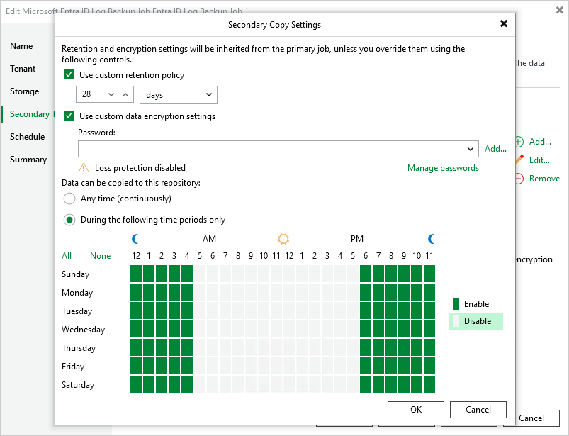

# Step 4. Configure Backup Copy Settings

In this article

[This step applies only if you have selected the Configure secondary destinations for this job check box at the Tenant step of the wizard]

Veeam Backup for Microsoft Entra ID stores tenant backups produced by all backup jobs in the same Microsoft Entra ID backup repository where the Veeam Backup & Replication configuration database resides. At the Secondary Target step of the wizard, you can increase data availability by instructing Veeam Backup for Microsoft Entra ID to copy the backed-up tenant data to another location — to do that, click Add and choose the necessary repository in the Select Repository window. For a backup repository to be displayed in the Secondary repositories list, it must be added to the backup infrastructure as described in in the Veeam Backup & Replication User Guide, section [Backup Repositories](https://helpcenter.veeam.com/docs/vbr/userguide/backup_repository.html?ver=13).

|  |
| --- |
| Note |
| To enhance data protection, you can instruct Veeam Backup for Microsoft Entra ID to copy tenant backups to multiple repositories. However, keep in mind that [Veeam Cloud Connect repositories](https://helpcenter.veeam.com/docs/backup/cloud/cloud_connect_repository.html?ver=13) are not supported. |

By default, Veeam Backup for Microsoft Entra ID will start creating backup copies as soon as the tenant backup job completes successfully, and will apply the same retention and encryption settings that you have configured at [step 3](entra_id_job_tenant.md). To change this behavior, you can do the following:

* Extend the retention period for the created backup copies — to do that, select the Use custom retention policy check box and specify a number of days (or months) for which Veeam Backup for Microsoft Entra ID will retain these copies.
* Increase the security of the created backup copies — to do that, select the Use custom data encryption settings check box and provide a specific password that will be used to access these copies.

For a password to be displayed in the list of available passwords, it must be added to the Password Manager as described in the Veeam Backup & Replication User Guide, section [Password Manager](https://helpcenter.veeam.com/docs/vbr/userguide/password_manager.html?ver=13). If you have not added the necessary password to the Password Manager beforehand, you can do it without closing the Secondary Copy Settings window. To do that, click either the Manage passwords link or the Add button, and specify the password and hint in the Password window.

* Prevent backup copy operations from overlapping with production hours — to do that, select the During the following time periods only check box and configure a specific time interval for Veeam Backup for Microsoft Entra ID to create backup copies.

|  |
| --- |
| Important |
| If a backup copy operation exceeds the configured time interval, this operation will be terminated automatically. |

Page updated 10/6/2025

Page content applies to build 13.0.1.1071
