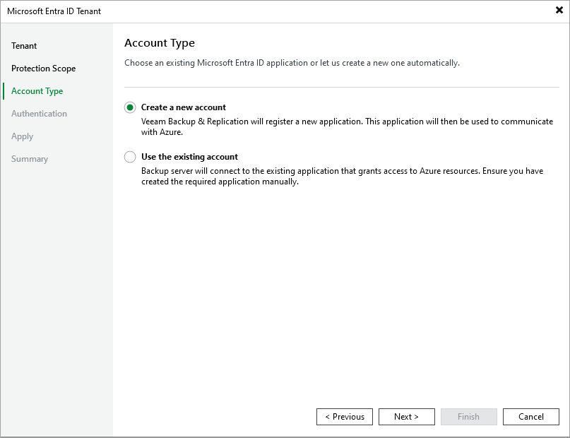

# Step 4. Choose Connection Method

In this article

At the Account Type step of the wizard, choose if you want to connect to Microsoft Azure using an existing or a newly created Microsoft Entra ID application. In the latter case, Veeam Backup & Replication will create a new Microsoft Entra ID application automatically.

Page updated 8/5/2025

Page content applies to build 13.0.1.1071
