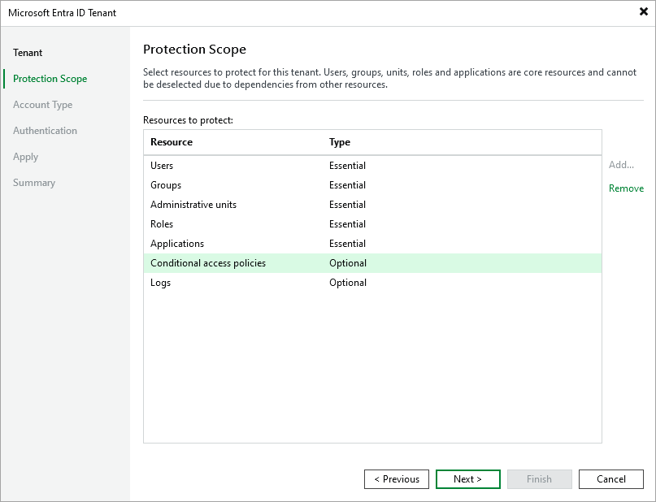

# Step 3. Specify Protection Scope

In this article

When you add a new tenant to Veeam Backup for Microsoft Entra ID, you can specify the scope of resources that the product will be able to protect for this tenant. By default, the protection scope contains users, groups, administrative units, roles, applications, logs, conditional access policies and intune policies.

At the Protection Scope step of the wizard, you can exclude resources from the protection scope — to do that, select the necessary resources and click Remove.

|  |
| --- |
| NoteS |
| * Resources that are marked as Essential cannot be excluded from the protection scope. * You will be able to update the protection scope later, using the [Edit Tenant](entra_id_edit_tenant.md) wizard. |

Page updated 11/19/2025

Page content applies to build 13.0.1.1071
