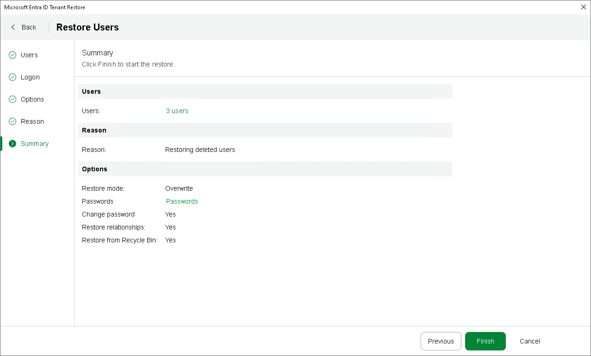

# Step 7. Finish Working with Wizard

In this article

At the Summary step of the wizard, review the summary information and click Finish.

If you have chosen to restore users at [step 2](entra_id_tenant_restore_items.md), you can export all the passwords created for these users at [step 5](entra_id_tenant_restore_options.md#psswd) as a single .CSV file. To do that, click Passwords — Veeam Backup & Replication will save the file with the exported data to the default download directory on the local machine.

|  |
| --- |
| Important |
| As soon as you click Finish, Veeam Backup for Microsoft Entra ID will check whether the provided passwords meet the [Microsoft Entra ID requirements](https://docs.azure.cn/en-us/entra/identity/authentication/concept-password-ban-bad-combined-policy). If a password does not comply with the length restrictions or complexity requirements, Veeam Backup for Microsoft Entra ID will check whether the user with the same object ID still exists in the Microsoft Entra ID production environment and will do either of the following:   * If the user still exists in the environment, the product will overwrite the new password. In this case, the user will be able to authenticate in the Microsoft Entra ID portal using the password from the backed-up password profile. * If the user exists in the environment but it is in the Entra ID Recycle Bin, the product will ignore the new password. In this case, the user will be able to authenticate in the Microsoft Entra ID portal using their current password. * If the user does not exist in the environment, the product will terminate the restore operation. |

Page updated 6/30/2025

Page content applies to build 13.0.1.1071
