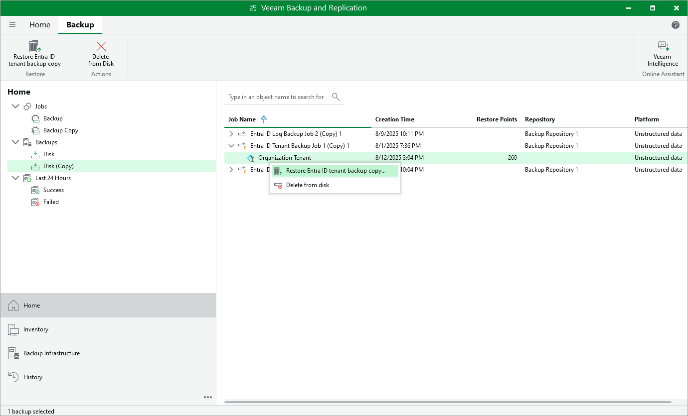

# Retrieving Tenant Data From Backup Copies

Backup copies stored in backup repositories (both primary and secondary) are not immediately accessible; if you want to restore tenant data from a backup copy, you must retrieve the data first. During the data retrieval process, Veeam Backup & Replication imports the unstructured backup copy data to the PostgreSQL database that stores Entra ID backups. The imported backups are displayed in the Home view under the Disk (Imported) node.

To retrieve tenant data from a backup copy, do the following:

1. In the Veeam Backup & Replication console, open the Home view and navigate to Backups > Disk (Copy).
2. In the working area, expand the backup job that protects the Microsoft Entra ID tenant whose backup copy you want to retrieve, select the tenant and click Restore Entra ID tenant backup copy on the ribbon.

Alternatively, you can right-click the tenant and select Restore Entra ID tenant backup copy.

1. In the Entra ID Tenant Backup Copy Restore window, choose a restore point that will be used to retrieve the data, specify a reason for performing the operation, and wait for the process to complete.

As soon as Veeam Backup & Replication retrieves the tenant data, you will be able to use the imported backup to [perform tenant restore](entra_id_tenant_restore.md).

