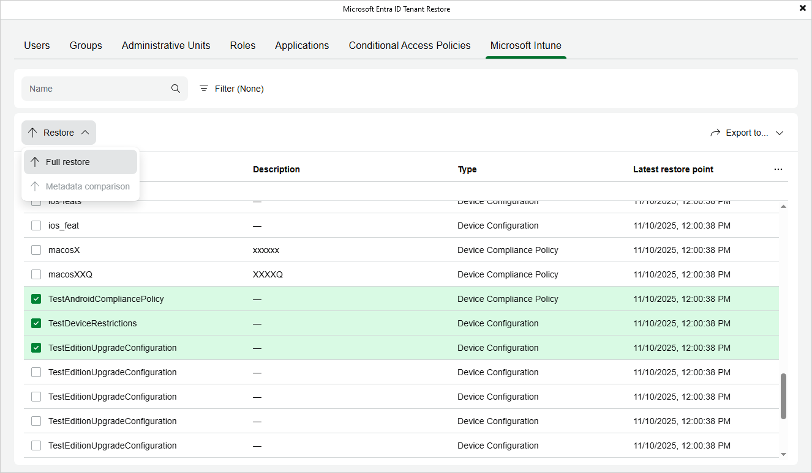

# Step 2. Choose Items to Restore

In this article

In the Microsoft Entra ID Tenant Restore wizard, switch to the necessary tab and then do either of the following:

* If you want to restore an item, select this item and click Restore > Full restore. Alternatively, right-click the item and select Restore > Full restore.

Veeam Backup for Microsoft Entra ID allows you to restore multiple items at a time. However, keep in mind that your selection is discarded when you switch between tabs since restoring different item types simultaneously is not supported.

* If you want to restore properties of an item, select this item and click Restore > Metadata comparison.

Veeam Backup for Microsoft Entra ID allows you to restore multiple properties at a time. However, keep in mind that restoring properties of different items simultaneously is not supported.

|  |
| --- |
| TipS |
| * You can narrow down the list of items available on the selected tab by applying a number of filters. To do that, either use the search field or click Filter (if available). You can use SQL wildcard characters % and \_ for item names search. * You can export the list of filtered items to further use it for any internal purposes or if you decide to add items to the restore scope at [step 3](entra_id_tenant_restore_point.md). To do that, click Export to and select the necessary format. Veeam Backup & Replication will save the file with the exported data to the default download directory on the local machine. |

Page updated 12/18/2025

Page content applies to build 13.0.1.1071
