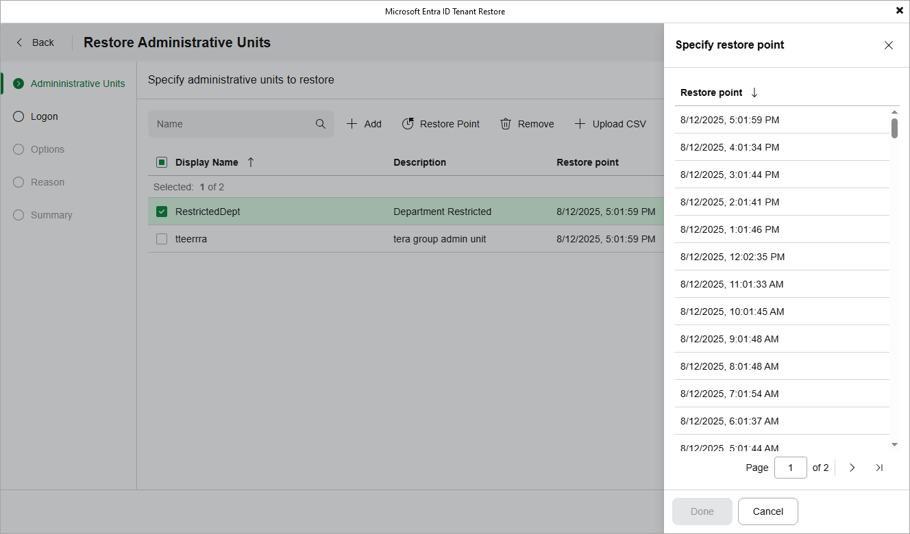

# Restoring Items

[This step applies only if you have selected the Full restore option when proceeding with the wizard]

By default, Veeam Backup & Replication uses the most recent valid restore point when restoring an item. However, you can restore the backed-up data to an earlier state. To do that:

1. Select the item and click Restore Point.
2. In the Specify restore point window, choose the necessary restore point and click Done.

Veeam Backup & Replication allows you to choose one restore point for multiple items. However, if the chosen restore point does not exist for any of the selected items, Veeam Backup for Microsoft Entra ID will display a warning notifying that the requested value was not found and will use the closest available restore point for these items instead.

|  |
| --- |
| Tip |
| If you want to adjust the restore scope, you can click Upload CSV to import the list if items that you have previously exported at [step 2](entra_id_tenant_restore_items.md). Keep in mind that you will have to manually modify the .CSV file to remove all columns except Id (or Id and DisplayName for users) before uploading the file — otherwise, Veeam Backup & Replication will not be able to process the file properly. |

