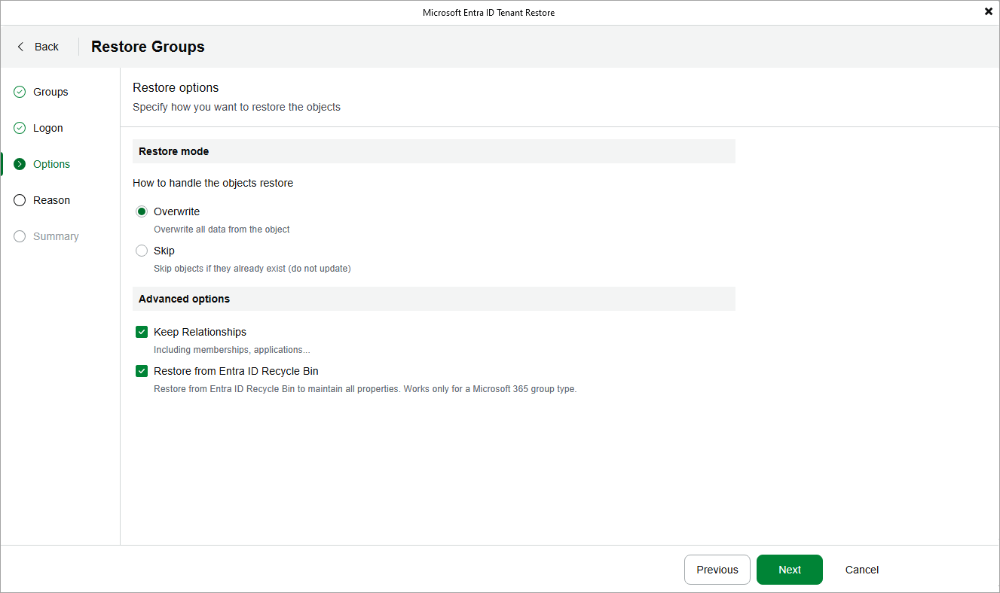

# Choosing Restore Mode

When processing an item added to the restore scope, Veeam Backup for Microsoft Entra ID checks whether the item still exists in the production environment:

* If the item still exists in the environment, Veeam Backup for Microsoft Entra ID also checks whether the unique identifier (object ID) of this item matches the identifier of the backed-up item. If it does, the product overwrites the original item data (excluding metadata, such as item creation date).

To change this behavior, select the Skip option in the Restore mode section of the Options step of the wizard. In this case, the product will exclude this item from the restore process and then proceed to another item.

* [This option is applicable only for the following item types: users, groups and applications] If the item exists in the environment but it is in the Entra ID Recycle Bin, the product restores this item from the Recycle Bin.

To change this behavior, clear the Restore from Entra ID Recycle Bin check box in the Advanced options section of the Options step of the wizard. In this case, the product will restore this item using the backed-up data. For more information, see [Configuring Advanced Options](entra_id_tenant_restore_options_advanced.md#recyclebin).

* If the item does not exist in the environment, Veeam Backup for Microsoft Entra ID restores this item using the backed-up data.

  

