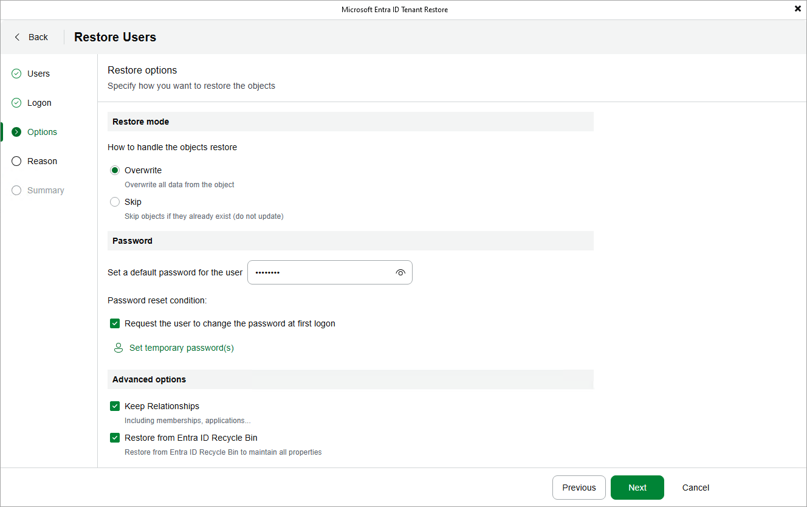

# Setting User Passwords

[This step applies only if you have chosen to restore users when proceeding with the wizard]

When processing a user added to the restore scope, Veeam Backup for Microsoft Entra ID resets their password. For the restored user to be able to authenticate in the Microsoft Entra ID portal, a new password must be created for this user — to do that, provide the password in the Password section of the Options step of the wizard. The password must meet the length restrictions and complexity requirements listed in [Microsoft Docs](https://learn.microsoft.com/en-us/entra/identity/authentication/concept-sspr-policy).

By default, Veeam Backup for Microsoft Entra ID will apply the provided password to all users in the restore scope. To change this behavior, click Set temporary password(s) and specify a new password for each user — to do that, you can either specify the passwords manually or click Autogenerate password(s) to create them automatically. You can then click Export to save the new passwords as a single .CSV file to the default download directory on the local machine.

|  |
| --- |
| Tip |
| For security reasons, all new passwords are considered as temporary and the restored users are prompted to reset these passwords as soon as they log in to the Microsoft Entra ID portal for the first time. To change this behavior, clear the Request the user to change the password at first logon check box. |

