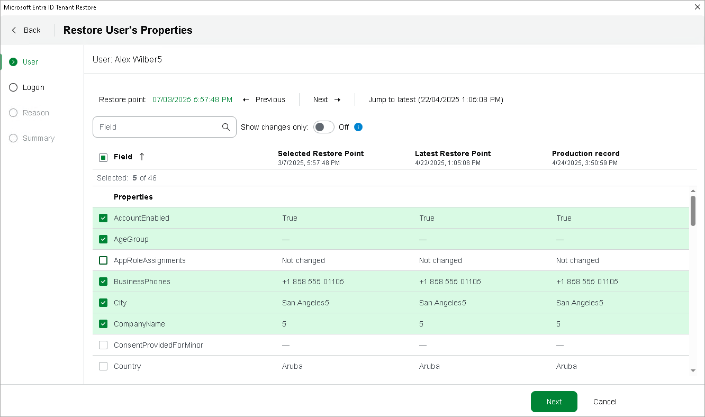

# Restoring Item Properties

In this article

[This step applies only if you have selected the Metadata comparison option when proceeding with the wizard]

By default, Veeam Backup & Replication uses the second most recent restore point when restoring item properties. However, you can restore the backed-up data to an earlier or a later state. To do that:

1. Click the link in the Restore point field.
2. Choose the necessary restore point in the calendar.

To help you choose a restore point, Veeam Backup for Microsoft Entra ID provides a comparison between property values contained in the selected restore point, in the most recent restore point and in the current Microsoft Entra ID production environment.

|  |
| --- |
| TipS |
| * By default, the comparison list includes only those properties whose values changed since any of the restore points was created. To view the full list of properties, set the Show changes only toggle to Off. * If you decide to choose the most recent restore point, you can click Jump to latest. Alternatively, you can click Previous and Next to switch between restore points. |

Page updated 10/15/2025

Page content applies to build 13.0.1.1071
