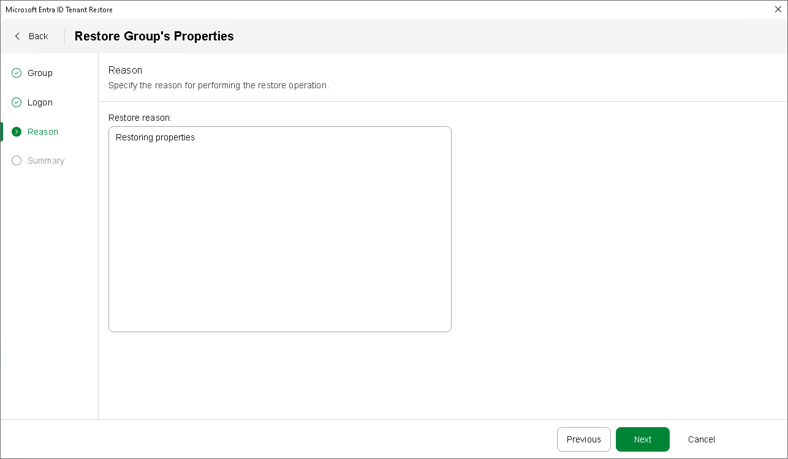

# Step 6. Specify Restore Reason

In this article

At the Reason step of the wizard, specify a reason for restoring tenant data. This information will be saved to the session history, and you will be able to reference it later.

Page updated 5/28/2025

Page content applies to build 13.0.1.1071
