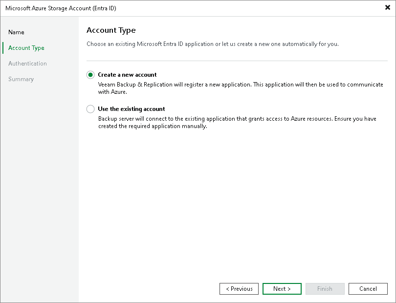

# Step 3. Select Account Type

In this article

At the Account Type step of the wizard, choose whether you want to connect to Microsoft Azure using an existing or a newly created Microsoft Entra application. In the latter case, Veeam Backup & Replication will create a new Microsoft Entra application automatically.

Page updated 3/7/2024

Page content applies to build 13.0.1.1071
