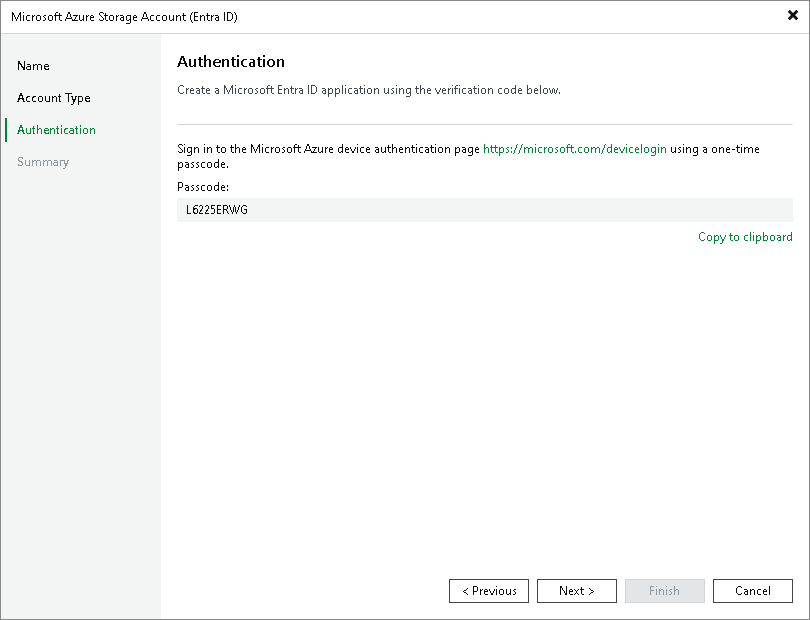

# Creating New Microsoft Entra Application

This step applies only if you have selected the Create a new account option at the [Account Type](entraid_access.md) step of the wizard.

Configuring Microsoft Entra Application

When you choose to create a new account, Veeam Backup & Replication registers a new Microsoft Entra application with a Microsoft Entra tenant. Veeam Backup & Replication will use this application to authenticate to Microsoft Azure. For more information on Microsoft Entra applications, see [Microsoft Docs](https://docs.microsoft.com/en-us/azure/active-directory/active-directory-application-objects). To create the Microsoft Entra application, you must use a single-use verification code that Veeam Backup & Replication provides you.

At the Authentication step of the wizard, do the following:

1. Click Copy to clipboard to copy the verification code.
2. Click the <https://microsoft.com/devicelogin> link.
3. On the Microsoft Azure device authentication page, do the following:

1. Paste the code that you have copied and click Next. Note that the code will expire in 15 minutes.
2. Specify a Microsoft Entra account that will be used to create an application. Note that the user name must be specified in the [user principal name format](https://docs.microsoft.com/en-us/azure/active-directory/hybrid/plan-connect-user-signin#user-sign-in-and-user-principal-name) (username@domain). The account must have permissions described in section [Permissions](required_permissions.md#entraid).

Veeam Backup & Replication will create Microsoft Entra application in the tenant of the account.

1. Go back to the Add Azure Account wizard and check whether any errors occurred during the authentication process.

|  |
| --- |
| Note |
| Consider the following:   * If you have multiple tenants associated with the Microsoft Entra user account that you plan to use to create a new application, Veeam Backup & Replication will create the single-tenant application in the home tenant of the account. As a result, the application can have access only to resources in the subscriptions of the home tenant. If you want to use storage account in another tenant subscriptions, follow the instructions [this Veeam KB article](https://www.veeam.com/kb4108).  * The created Microsoft Entra application is assigned with the following roles for a storage account which name was entered at the [Name step of the wizard](entraid_name.md):  * Storage Account Contributor * Storage Blob Data Contributor * Storage Blob Data Owner   For more information on roles, see [Microsoft Azure Docs](https://docs.microsoft.com/en-us/azure/active-directory/role-based-access-built-in-roles#owner). You can limit the subscriptions to which Veeam Backup & Replication assigns the privileges as described in [this Veeam KB article](https://www.veeam.com/kb4406). |

