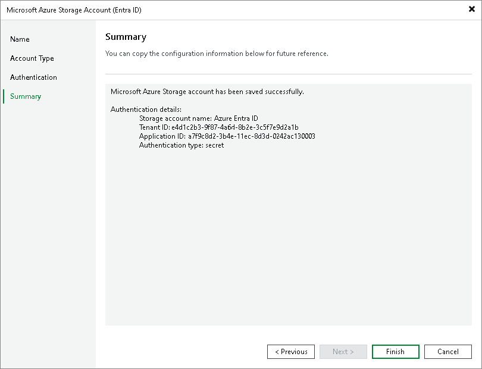

# Step 5. Finish Working with Wizard

In this article

At the Summary step of the wizard, review details of configured settings and click Finish to close the wizard.

Page updated 8/14/2025

Page content applies to build 13.0.1.1071
