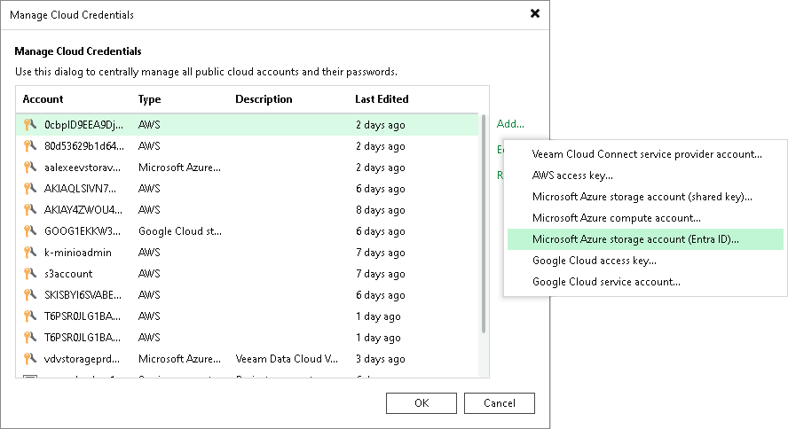

# Step 1. Launch Microsoft Azure Storage Account (Entra ID) Wizard

To launch the Microsoft Azure Storage Account (Entra ID) wizard, do the following:

1. In the [main menu](vbr_ui.md#main_menu), click Credentials and Passwords > Cloud Credentials.
2. In the Manage Cloud Credentials window, click Add and select Microsoft Azure storage account (Entra ID).

