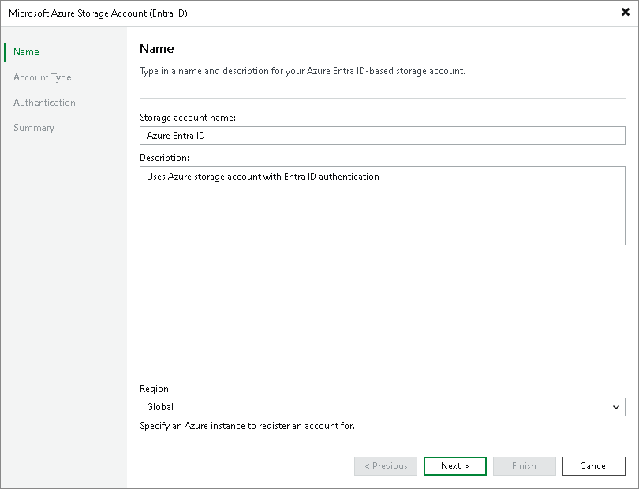

# Step 2. Specify Account Name

In this article

At the Name step of the wizard, specify an Azure storage account name. From the Region drop-down list, select a Microsoft Azure region where the storage account is located.

Page updated 12/4/2023

Page content applies to build 13.0.1.1071
