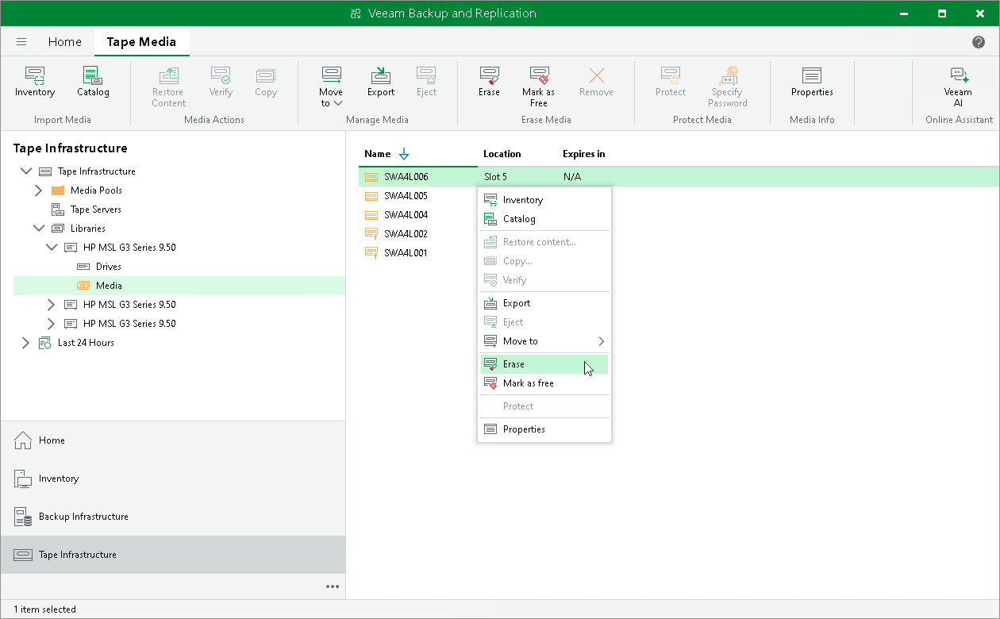

# Erasing Tapes

In this article

If you do not need the contents stored on tape, you can erase tapes. Veeam Backup & Replication supports two options for erasing data:

* Short erase (fast) — use this option to speed up the erase process. The short erase operation does not physically erase data written on the tape. It loads the tape into the drive and wipes the tape header. Note that short erase is not supported by some tape devices.
* Long erase (slow) – use this option to clear all data written to tape. The long erase operation loads the tape into the drive, rewinds the tape and physically erases all data written to the tape by overwriting the tape's contents with zeros.

To erase tapes:

1. Open the Tape Infrastructure view.
2. Navigate to the list of tapes either under Media Pools or under Libraries > LibraryName node > Media > Online.
3. Select tapes you want to erase and click Erase on the ribbon. Choose the type of erase and click OK.

|  |
| --- |
| Important |
| You cannot erase protected tapes. To erase such tapes, you need to switch the protection off first. |

Page updated 6/26/2025

Page content applies to build 13.0.1.1071
