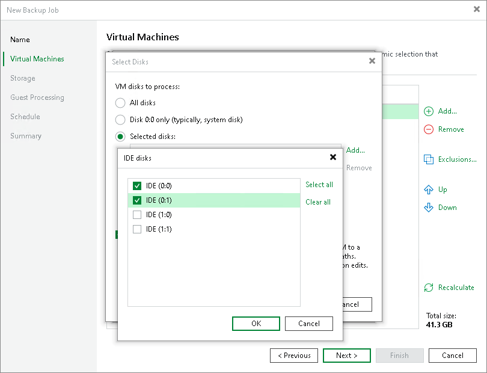

# VMs and VM Disks

When you configure a backup or replication job, you can exclude the following objects from processing:

* [VMs added as a part of a VM container](#container)
* [Individual VM disks](#disks)
* [For backup jobs] [VM templates](#template)

VMs as Part of Container

If you want to back up or replicate a VM container that holds several VMs but want to skip some VMs, you can exclude specific VMs from the job processing. This option will help you reduce the size of the resulting backup or replica and increase the job performance.

You can define which VMs you want to skip at the Virtual Machines step of the backup or replication job wizard.

Individual VM Disks

You can choose what VM disks you want to back up or replicate:

* All VM disks
* 0:0 disks (which are commonly the VM system disks)
* Specific IDE, SCSI or SATA disks

For example, you may want to back up or replicate only the system disk instead of creating a backup or replica of a full VM. VM disks exclusion reduces the size of the backup or replica.

You can define which VM disks you want to back up or replicate at the Virtual Machines step of the backup or replication job wizard. You can specify disk processing settings granularly for every VM in the job or for the whole VM container. In the latter case, Veeam Backup & Replication will apply the configured rule to all VMs in this container.

You can additionally instruct Veeam Backup & Replication to modify the configuration file of the VM. When you start a VM from the backup or failover to the VM replica, you will be able to use such a VM immediately. You will not have to edit its configuration file and remove excluded disks from it.

VM Templates

You can include VM templates in the backup. Backing up VM templates provides additional safety of your production environment but requires additional space in the backup repository.

Veeam Backup & Replication allows you to include a VM template only in the full backup and omit it in incremental backups. Note that Veeam Backup & Replication cannot use Direct SAN transport mode to back up VM template data. If you [have configured failing over to the Network mode](vmware_proxy_server.md), the Network mode will be used.

You can define how Veeam Backup & Replication must process VM templates at the Virtual Machines steps of the wizard.

