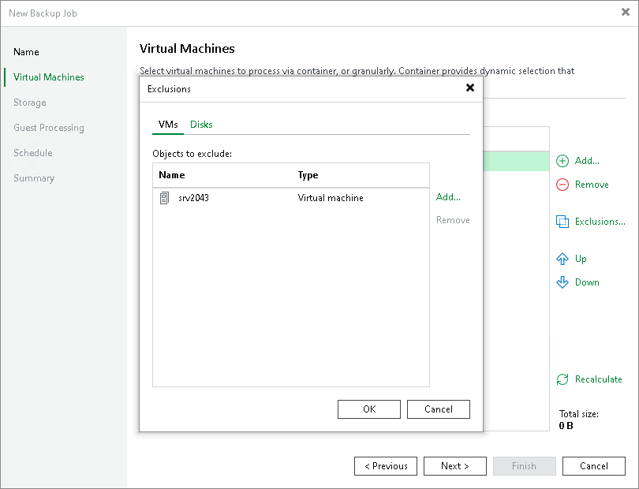
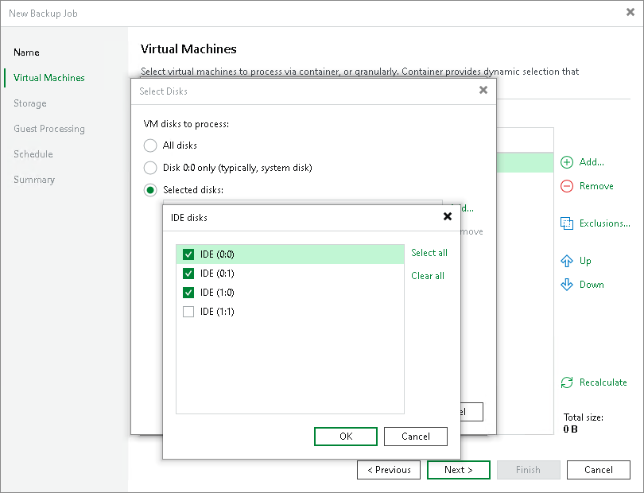

# VMs and VM Disks

In this article

When you configure a backup or replication job, you can exclude the following objects from processing:

* [VMs added as a part of a VM container](#container)
* [Individual VM disks](#disks)

VMs as Part of Container

If you want to back up or replicate a VM container that holds several VMs but want to skip some VMs, you can exclude specific VMs from the job processing. This option will help you reduce the size of the resulting backup or replica and increase the job performance.

You can define which VMs you want to skip at the Virtual Machines step of the backup or replication job wizard.

Individual VM Disks

You can choose what VM disks you want to back up or replicate:

* All VM disks
* 0:0 disks (which are commonly the VM system disks)
* Specific IDE or SCSI disks

For example, you may want to back up or replicate only the system disk instead of creating a backup or replica of a full VM. VM disks exclusion reduces the size of the backup or replica.

You can define which VM disks you want to back up or replicate at the Virtual Machines step of the backup or replication job wizard. You can specify disk processing settings granularly for every VM in the job or for the whole VM container. In the latter case, Veeam Backup & Replication will apply the configured rule to all VMs in this container.

Page updated 2/11/2025

Page content applies to build 13.0.1.1071
