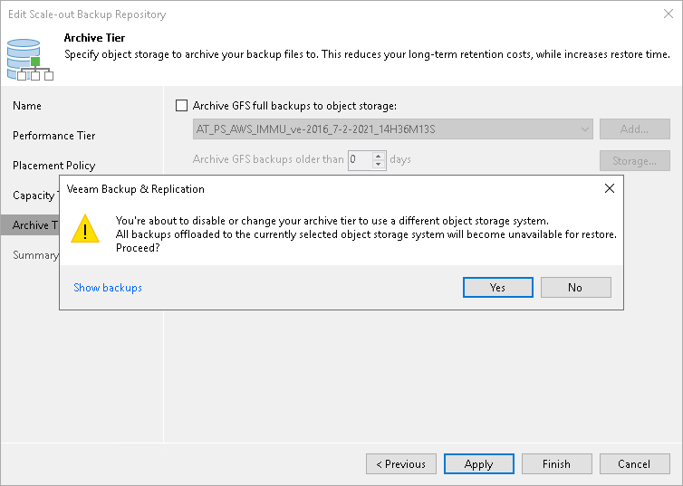

# Excluding Archive Extent from Scale-Out Backup Repository

You can exclude an archive extent from the scale-out backup repository scope, for example, if you no longer want to use any third party services to store your data.

Consider that after you exclude an object storage repository that is being used as an archive extent and is storing archived backup data, Veeam Backup & Replication automatically puts the excluded object storage repository into the Maintenance mode. Once a repository is in the Maintenance mode, you will not be able to restore your data from it. To switch back to normal, you will have to re-add that repository as an archive extent and synchronize existing backup chains with data in this scale-out backup repository. After the synchronization is complete, the existing backups will become available as Imported.

To exclude an archive extent from the scale-out backup repository scope, do the following:

1. Open the Backup Infrastructure view.
2. In the [inventory pane](vbr_ui.md), click Scale-out Repositories.
3. In the working area, select a scale-out backup repository and click Edit Scale-out Repository on the ribbon, or right-click a scale-out backup repository and select Properties.
4. Move to the Archive tier step of the wizard.
5. Clear the Archive GFS full backups to object storage check box.

You will be asked to confirm the action in the dialog box. After that, the object storage repository will be immediately put into the Maintenance mode.

