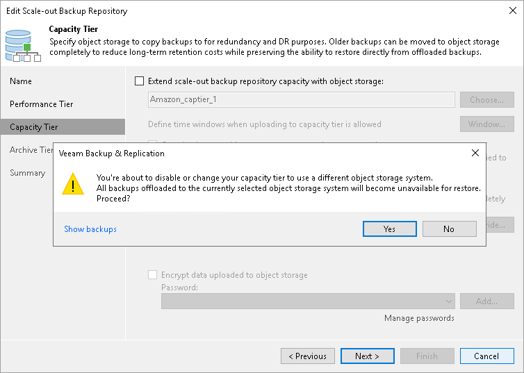

# Excluding Capacity Extent from Scale-Out Repositories

In this article

You can exclude a capacity extent from the scale-out backup repository scope, for example, if you no longer want to use any third party services to store your data.

Consider that after you exclude an object storage repository that is being used as a capacity extent and is storing offloaded backup data, Veeam Backup & Replication automatically puts the excluded object storage repository into the Maintenance mode. Once a repository is in the Maintenance mode, you will not be able to restore your data from it. To switch back to normal, you will have to re-add that repository as a capacity extent and synchronize existing backup chains with your performance extents. After the synchronization is complete, the existing backups will become available as Imported. For more information, see [Synchronizing Capacity Tier Data](new_capacity_tier.md#sync_tier_data).

|  |
| --- |
| Note |
| If you have an archive extent in the same scale-out backup repository, it will also switch to the Maintenance mode when you exclude a capacity extent. Note that this is not applied if you use the same object storage repository by the same provider for performance, capacity and archive tiers, for example, by Amazon S3. In this case, after removing a capacity extent from capacity tier the performance and archive tiers will remain in a scale-out backup repository. |

To exclude a capacity extent from the scale-out backup repository scope, do the following:

1. Open the Backup Infrastructure view.
2. In the [inventory pane](vbr_ui.md), click Scale-out Repositories.
3. In the working area, select a scale-out backup repository and click Edit Scale-out Repository on the ribbon, or right-click a scale-out backup repository and select Properties.
4. Move to the Capacity tier step of the wizard.
5. Clear the Extend scale-out backup repository capacity with object storage check box.

If you have data on the object storage, you will be asked to confirm the action in the dialog box. After that, the object storage repository will be immediately put into the Maintenance mode.

Related Topics

[Switching to Maintenance Mode](sobr_maintenance.md)

Page updated 5/29/2024

Page content applies to build 13.0.1.1071
