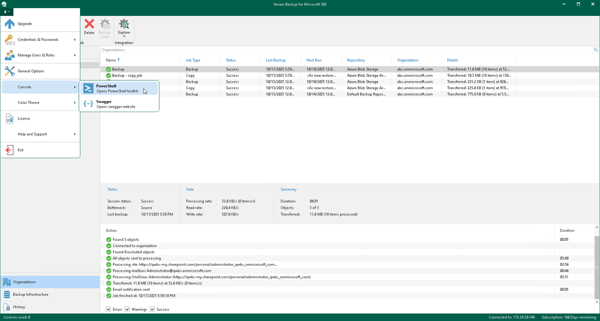

In this article

You can start a PowerShell session directly from Veeam Backup & Replication or Veeam Backup for Microsoft 365 user interface.

In this case, you will be able to perform actions with Veeam Explorers cmdlets without any additional configuration steps. As soon as you run a PowerShell session either from Veeam Backup & Replication or Veeam Backup for Microsoft 365, all related PowerShell modules are automatically imported into the active memory.

|  |
| --- |
| Note |
| [For Linux-based Veeam Backup & Replication backup servers] After you start a PowerShell session from a Veeam Backup & Replication console, you must run the [Connect-VBRServer](https://helpcenter.veeam.com/docs/vbr/powershell/connect-vbrserver.html?ver=13) cmdlet to connect to the backup server. |

For more information on the Veeam Backup & Replication PowerShell module, see the [Getting Started](https://helpcenter.veeam.com/docs/vbr/powershell/getting_started.html?ver=13) section of the Veeam PowerShell Reference.

For more information on the Veeam Backup for Microsoft 365 PowerShell module, see the [Getting Started](https://helpcenter.veeam.com/docs/vbo365/powershell/getting_started.html?ver=80) section of the Veeam Backup for Microsoft 365 PowerShell Reference.

To start a PowerShell session, do one of the following:

* In the main menu of the Veeam Backup & Replication console, select Console > PowerShell.

* In the main menu of Veeam Backup for Microsoft 365, select Console > PowerShell.

Page updated 11/25/2025

Page content applies to build 13.0.1.1071
